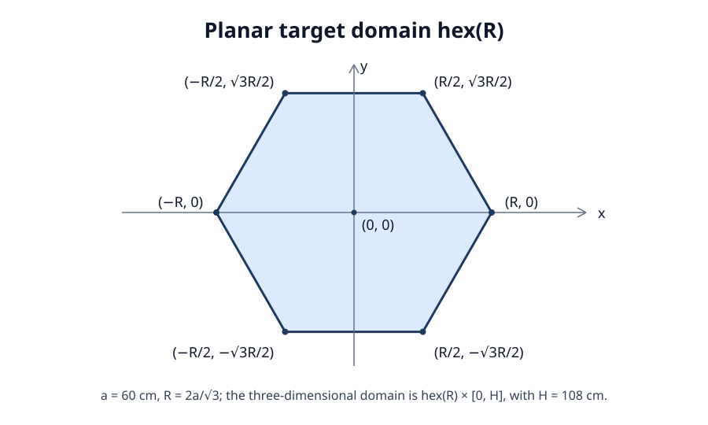
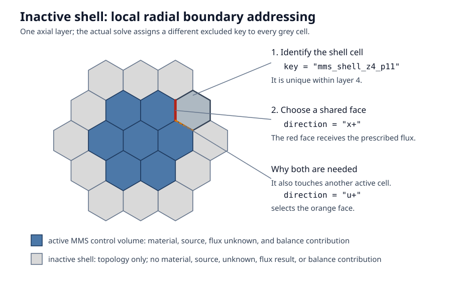
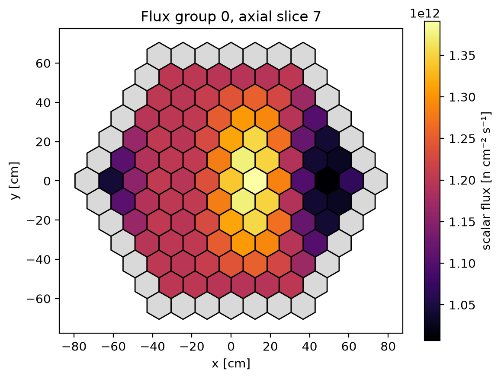
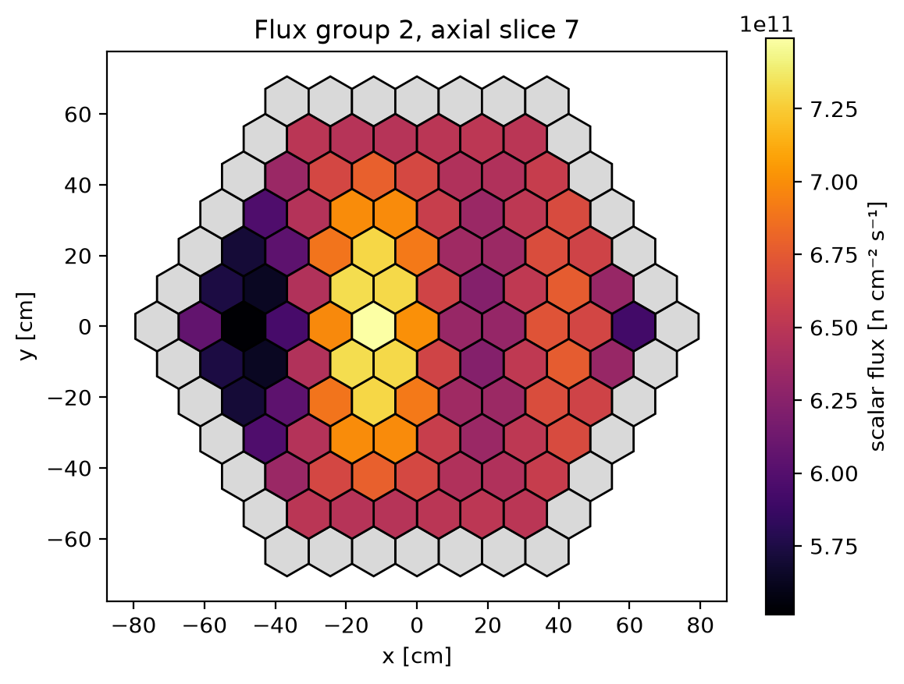
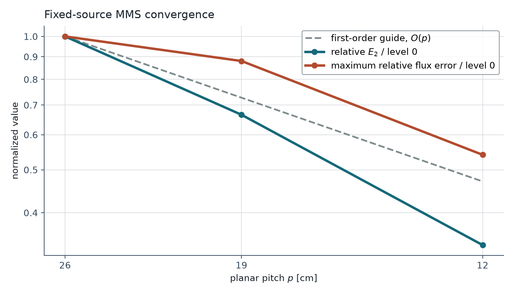

# Fixed-source manufactured-solution case

This page documents Morana's fixed-source method of manufactured solutions
(MMS) verification case. Its executable form is
[`examples/fixed_source_mms.py`](https://github.com/tannhorn/morana/blob/main/examples/fixed_source_mms.py).

At each refinement level, the case solves a three-group, nonfissioning
diffusion problem with radial and axial diffusion, unequal-height layers,
P0 scattering with non-unit neutron multiplicity, volumetric sources, and
nonzero Dirichlet boundary data. The source, reference flux, and boundary
values are evaluated independently of Morana's assembled operators. The case
also exercises balance reporting and directional excluded-region boundary
selection.

## Method of manufactured solutions

MMS is a code-verification technique for partial-differential-equation
solvers. Choose a sufficiently smooth exact field, substitute it into the
continuous equations to derive a forcing term and boundary data, then compare
the discrete solution with independently evaluated exact values as the mesh is
refined. It tests implementation consistency and observed accuracy; it is not
experimental validation of the model. This example applies the general MMS
code-verification pattern described by
[Salari and Knupp (2000)](#salari-knupp-2000); its geometry, fields, material
data, and acceptance criteria are Morana-specific.

## Target geometry and refinements

The limiting domain is the regular hexagonal prism

$$
\Omega=\operatorname{hex}(R)\times[0,H],
\qquad a=60\ \mathrm{cm},\quad R=\frac{2a}{\sqrt{3}}
=40\sqrt{3}\ \mathrm{cm},\quad H=108\ \mathrm{cm},
$$

where $a$ is the planar center-to-flat distance (apothem) and $R$ is the
standard center-to-corner distance (circumradius). The planar hexagon has
vertices

$$
(\pm R,0),\qquad
\left(\pm\frac{R}{2},\ \pm\frac{\sqrt{3}R}{2}\right).
$$



At every refinement level, the modeled active core has a complete regular
hexagonal cluster as its planar cross section. The union of its control volumes
converges to the target hexagonal prism as the pitch decreases. Let $\Omega_p$
be this active planar union at pitch $p$. For a cluster with $n$ rings, its
circumscribed large hexagon fixes the largest permitted pitch as

$$
\frac{R}{p}=n-\frac{1}{3},
\qquad
p=\frac{R}{n-\frac{1}{3}}.
$$

The resulting $\Omega_p$ is wholly inside $\operatorname{hex}(R)$, and
its faceted, cell-face boundary approaches the target hexagon from the inside
as $p$ decreases. The levels do not form a nested sequence, but their
boundary displacement from the target is $O(p)$, so $\Omega_p$ converges
to $\operatorname{hex}(R)$. The top and bottom faces are unchanged at
$z=0$ and $z=H$.

| Level | Active rings | Complete mesh rings | Pitch [cm] | Axial layers | Maximum layer height [cm] |
| ---: | ---: | ---: | ---: | ---: | ---: |
| 0 | 3 | 4 | 25.981 | 6 | 24 |
| 1 | 4 | 5 | 18.895 | 9 | 16 |
| 2 | 6 | 7 | 12.226 | 12 | 12 |

The axial meshes retain unequal heights. Each of the three base bands, with
heights $2H/9$, $3H/9$, and $4H/9$, is split into two equal sublayers at
level 0, three at level 1, and four at level 2. Both radial and axial
resolution therefore increase over the study.

Each active three-dimensional control volume carries one scalar-flux unknown
per energy group. With $G=3$, active-cell counts of $114$, $333$, and
$1{,}092$ give
$3\times114=342$, $3\times333=999$, and $3\times1{,}092=3{,}276$
degrees of freedom at levels 0, 1, and 2, respectively. The count excludes
the topological shell described next.

## Active core and inactive shell

The example uses the material mesh itself to express local radial Dirichlet
data using supported topology selectors.

| Complete-mesh allocation | Key and status | Purpose |
| --- | --- | --- |
| Outermost OpenMC ring (`ring == 0`) | A unique `mms_shell_z<layer>_p<position>` excluded key | Inactive shell that exposes local `to_excluded` radial faces |
| Every inner ring | Active `mms_medium` material | Manufactured-solution control volumes |

Every shell key is registered as an
[`ExcludedRegion`](reference/core.md#morana.ExcludedRegion) of kind
`mms_boundary`. The shell serves only as topology: a radial face of an active
cell sees a known, addressable excluded neighbor. Shell cells have no cross
sections, volumetric source, unknown, flux result, or balance contribution.

For each active radial face, the example assigns a unique prescribed-flux
condition using both the excluded key and the direction label:

```python
BoundaryCondition.dirichlet(face_average).on_excluded(
    key=shell_key,
    direction=face_direction,
)
```

For illustration, two assignments from refinement level 1 are shown below.
Level 1 is the second of the three levels in the table above; it has four
active rings and nine axial layers. Its zero-based axial layer 4 is the fifth
layer, spanning $36\le z\le48\ \mathrm{cm}$. Each `face_average...`
placeholder stands for a prescribed face-average flux computed independently
by quadrature.

```python
# active_id=5, direction="u-"
BoundaryCondition.dirichlet(face_average_z4_p7_u_minus).on_excluded(
    key="mms_shell_z4_p7",
    direction="u-",
)

# active_id=14, direction="u+"
BoundaryCondition.dirichlet(face_average_z4_p19_u_plus).on_excluded(
    key="mms_shell_z4_p19",
    direction="u+",
)
```

An excluded shell cell can neighbor more than one active cell, but the pair
`(shell_key, face_direction)` identifies one active face. Shell keys are also
unique by axial layer, so the value may vary with axial position. The example
asserts that every active radial boundary face is `to_excluded`, none is
`outer`, and each resolves to its intended local Dirichlet assignment.

The following schematic uses Morana's
[`x`, `u`, and `v` face-direction labels](geometry.md#single-cell-geometry)
and its OpenMC-style
[`orientation="x"` ring-position ordering](geometry.md#2d-lattice-coordinates):
positions start at positive `x` and proceed clockwise.



At levels 0, 1, and 2 there are respectively 30, 42, and 66 such active radial
faces per layer. Multiplying by 6, 9, and 12 layers gives whole-domain totals
of 180, 378, and 792.

Top and bottom are ordinary physical exterior faces. Their prescribed vectors
are assigned with `on_bottom()` and `on_top()`.

## Exact multigroup field

Public group order is fast to thermal. Define

$$
X=\frac{\pi x}{a},\qquad
Y=\frac{\pi y}{\sqrt{3}a},\qquad
Z=\frac{\pi z}{H},
$$

and, for each group,

$$
f_g(x,y)=a_g\cos(X)\cos(Y)+b_g\sin(2X)\cos(Y),
$$

$$
\phi_g(x,y,z)=\Phi_g[1+\sin(Z)f_g(x,y)].
$$

| Group $g$ | $\Phi_g$ [n cm$^{-2}$ s$^{-1}$] | $a_g$ | $b_g$ |
| ---: | ---: | ---: | ---: |
| 0 | $1.20\times10^{12}$ | 0.12 | 0.07 |
| 1 | $0.85\times10^{12}$ | -0.09 | 0.11 |
| 2 | $0.65\times10^{12}$ | 0.08 | -0.10 |

The coefficients keep all three exact fluxes positive while giving each a
distinct shape. Since $\sin(Z)=0$ at $z=0$ and
$z=H$, the axial boundary data are the constant vector
$(\Phi_0,\Phi_1,\Phi_2)$.

## Manufactured source

The homogeneous, nonfissioning material uses

$$
D=(1.40,0.80,0.35)\ \mathrm{cm},
$$

$$
\Sigma_a=(0.030,0.040,0.055)\ \mathrm{cm}^{-1},
$$

and the complete P0 scattering matrix, indexed by incident and outgoing group,
in $\mathrm{cm}^{-1}$:

$$
\Sigma_s=
\begin{bmatrix}
0.0030 & 0.0040 & 0.0010\\
0.0005 & 0.0025 & 0.0060\\
0.0002 & 0.0008 & 0.0040
\end{bmatrix}.
$$

The matching incident-to-outgoing scattering-multiplicity matrix is

$$
M=
\begin{bmatrix}
1.10 & 1.15 & 1.05\\
1.00 & 0.90 & 1.10\\
1.20 & 1.00 & 1.05
\end{bmatrix}.
$$

There is no fission production. Ordinary scattering events define removal,

$$
\Sigma_{r,g}=\Sigma_{a,g}+
\sum_h\Sigma_{s,g\to h}-\Sigma_{s,g\to g},
$$

while scattering-neutron coupling is defined componentwise by

$$
C_{g,h} =
\begin{cases}
M_{g,h}\Sigma_{s,g\to h}, & g\ne h,\\
(M_{g,g}-1)\Sigma_{s,g\to g}, & g=h.
\end{cases}
$$

Equivalently,

$$
C=M\odot\Sigma_s-
\operatorname{diag}\!\left(\operatorname{diag}\Sigma_s\right).
$$

Here the nested diagonal notation extracts the diagonal of $\Sigma_s$ and
places it back on a diagonal matrix. The chosen coefficients exercise both
kinds of non-unit-multiplicity effect, including signed same-group coupling.
Evaluating the independently prescribed source from the exact multigroup field
gives

$$
Q_g=-D_g\nabla^2\phi_g+\Sigma_{r,g}\phi_g
-\sum_h C_{h,g}\phi_h.
$$

The radial Laplacian is evaluated directly from

$$
\nabla_{xy}^2\bigl[\cos(X)\cos(Y)\bigr]
=-\left[\left(\frac{\pi}{a}\right)^2
+\left(\frac{\pi}{\sqrt{3}a}\right)^2\right]\cos(X)\cos(Y).
$$

For $\sin(2X)\cos(Y)$, the squared $x$ factor becomes
$\left(2\pi/a\right)^2$, while the $y$ factor is unchanged. The axial term
contributes $-\left(\pi/H\right)^2\sin(Z)f_g$. The selected
coefficients make every cell-averaged source value finite and nonnegative, as
required by the fixed-source input contract. Source units are
$\mathrm{n\,cm^{-3}\,s^{-1}}$.

## Discrete MMS data

The continuous manufactured fields must be reduced to one value per active
hex-z control volume $c$. The example independently computes the volume
averages

$$
\bar Q_{g,c}=\frac{1}{V_c}\int_cQ_g\,dV,
\qquad
\bar\phi_{g,c}=\frac{1}{V_c}\int_c\phi_g\,dV.
$$

$\bar Q_{g,c}$ is the volumetric source density passed to
[`CellSource`](reference/core.md#morana.CellSource); it has units
$\mathrm{n\,cm^{-3}\,s^{-1}}$. $\bar\phi_{g,c}$ is the cell-average reference
flux used for the error calculation and has the same meaning as Morana's
scalar-flux unknown. During finite-volume assembly, Morana multiplies the
source density by the cell volume, so its volume-integrated right-hand-side
contribution is $\bar Q_{g,c}V_c$.

To calculate these integrals, the example splits each hexagon into six
triangles. Each triangle is formed by the cell center $\boldsymbol r_c$ and
two consecutive vertices. Number the vertices $\boldsymbol v_0,\ldots,
\boldsymbol v_5$ counterclockwise. Then triangle $j$ uses
$\boldsymbol v_j$ and $\boldsymbol v_{(j+1)\bmod 6}$, with

$$
\boldsymbol a_j=\boldsymbol v_j-\boldsymbol r_c,
\qquad
\boldsymbol b_j=\boldsymbol v_{(j+1)\bmod 6}-\boldsymbol r_c.
$$

Thus $\boldsymbol a_j$ and $\boldsymbol b_j$ are the vectors from
$\boldsymbol r_c$ to triangle $j$'s two outer vertices, and
$J_j=|\boldsymbol a_j\mathbin{\times}\boldsymbol b_j|$. The map

$$
\boldsymbol r_j(t,s)=\boldsymbol r_c+
t\bigl[(1-s)\boldsymbol a_j+s\boldsymbol b_j\bigr],
\qquad z=z_0+h\zeta,
$$

maps $(t,s,\zeta)\in[0,1]^3$ to triangle $j$'s axial prism. Its Jacobian is
$tJ_jh$. Thus, for a group component $F$, the independently evaluated
cell integral is approximated by

$$
\int_c F\,dV \approx
\sum_{j=0}^{5}\sum_{i,k,\ell=1}^{3}
\omega_i\omega_k\omega_\ell\,
\xi_iJ_jh\,
F\!\left(
\boldsymbol r_j(\xi_i,\xi_k),z_0+h\xi_\ell
\right).
$$

Here $\xi_i$ and $\omega_i$ are the three-point Gauss--Legendre nodes
and weights mapped from $[-1,1]$ to $[0,1]$:

$$
\boldsymbol\xi=
\left(\frac{1-\sqrt{3/5}}{2},\frac12,
\frac{1+\sqrt{3/5}}{2}\right),
\qquad
\boldsymbol\omega=
\left(\frac5{18},\frac49,\frac5{18}\right).
$$

The rule therefore uses $6\times3^3=162$ quadrature points per control
volume. See the NIST Digital Library of Mathematical Functions discussion of
[Gauss quadrature](https://dlmf.nist.gov/3.5#v); the example obtains these
nodes and weights through NumPy's
[`leggauss`](https://numpy.org/doc/stable/reference/generated/numpy.polynomial.legendre.leggauss.html)
routine. This independent quadrature supplies both `CellSource` and the
reference flux; no Morana matrix or assembled right-hand side is used to
construct either value.

The radial boundary condition is imposed on the actual rectangular faces of
$\partial\Omega_p$. For every such face $f$, the assigned Dirichlet vector
is the area average

$$
\bar\phi_{g,f}=\frac{1}{A_f}\int_f\phi_g\,dA.
$$

The example approximates this integral numerically. It uses the same
three-point Gauss--Legendre rule as the volume average, but with two rather
than three tensor-product coordinates: one along the face and one through the
layer. Let $\boldsymbol x_f$ be the face center,
$\boldsymbol\tau_f$ its unit in-plane tangent, $\ell_f$ its length, and
$h$ the layer height. In this mapping it is convenient to retain the
standard nodes and weights on $[-1,1]$,

$$
\hat{\boldsymbol\xi}=(-\sqrt{3/5},0,\sqrt{3/5}),
\qquad
\hat{\boldsymbol\omega}=
\left(\frac59,\frac89,\frac59\right).
$$

The example then evaluates the face average as

$$
\bar\phi_{g,f}\approx
\frac14\sum_{i,j=1}^{3}\hat\omega_i\hat\omega_j\,
\phi_g\!\left(
\boldsymbol x_f+\frac{\ell_f}{2}\hat\xi_i\boldsymbol\tau_f,
z_0+\frac{h}{2}(1+\hat\xi_j)
\right).
$$

This is a nine-point tensor-product quadrature on the rectangular face. The
volume rule has $6\times3^3$ points because it integrates both coordinates of
each of the six center-to-edge triangles as well as the axial coordinate. The
face rule needs only $3^2$ points. Both evaluate the manufactured field
independently of Morana's assembled operator, so each discrete problem uses a
numerical approximation to the manufactured trace on its own ragged boundary.

Morana uses this scalar face value in its documented one-sided
cell-center-to-face Dirichlet elimination. The corresponding
face-integrated right-hand-side contribution is
$\mathcal{G}_{g,c,f}\bar\phi_{g,f}$, with the conductance and outward-current sign
convention defined in the
[boundary theory](theory_references.md#exposed-boundary-conditions).

## Measures and acceptance criteria

The reported solution error at refinement level $i$ is the volume-weighted
relative norm

$$
E_{2,i}=
\left[
\frac{\sum_{g,c}V_{c,i}\left(\phi^{(i)}_{g,c}-\bar\phi^{(i)}_{g,c}\right)^2}
{\sum_{g,c}V_{c,i}\left(\bar\phi^{(i)}_{g,c}\right)^2}
\right]^{1/2}.
$$

Successive observed orders use the actual planar-pitch ratio. For either error
measure $\mathcal E\in\{E_2,E_\infty\}$,

$$
q_{i\to i+1}(\mathcal E)=
\frac{\log(\mathcal E_i/\mathcal E_{i+1})}
{\log(p_i/p_{i+1})}.
$$

Here $i$ labels the refinement level, $p_i$ its planar hex pitch,
$\phi^{(i)}$ the computed flux, and $\bar\phi^{(i)}$ the independently
evaluated exact cell average.

The convergence plot also tracks the maximum relative flux error over every
group and active cell:

$$
E_{\infty,i}=
\max_{g,c}\frac{\left|\phi^{(i)}_{g,c}-\bar\phi^{(i)}_{g,c}\right|}
{\bar\phi^{(i)}_{g,c}}.
$$

Both error measures are normalized to their level-0 values:

$$
\widehat E_{2,i}=\frac{E_{2,i}}{E_{2,0}},
\qquad
\widehat E_{\infty,i}=\frac{E_{\infty,i}}{E_{\infty,0}}.
$$

Therefore both curves begin at 1.0 at level 0 and show complementary global
and worst-case solution-error behavior. The linear and scalar balance
residuals are used as acceptance checks during solution.

The executable example requires all of the following:

- relative linear residual and scalar balance residual at most $10^{-11}$;
- strictly decreasing $E_2$ over the three levels;
- strictly decreasing $E_\infty$ over the three levels.

Observed orders are reported as diagnostics, not acceptance thresholds. They
do not by themselves establish an asymptotic order for this short,
nonuniform-refinement study: each level has a different, ragged active domain
whose boundary is displaced by $O(p)$, so the domains are not nested and the
set of exposed radial faces changes between levels. In addition, the supplied
cell-average source, reference flux, and boundary traces are numerical
Gauss--Legendre quadratures rather than analytic integrals. Their finite
quadrature error contributes to the measured solution error alongside the
finite-volume discretization error. Unequal axial-layer heights provide a
further changing resolution scale. Establishing an asymptotic rate would
require more refinement levels and a quadrature-sensitivity study.

## Results and reproduction

Run the maintained case from the repository root:

```bash
python examples/fixed_source_mms.py
```

To repeat the full refinement study with every supported direct and GMRES
linear policy, add `--compare-strategies`:

```bash
python examples/fixed_source_mms.py --compare-strategies
```

Each policy is checked independently against the manufactured flux and the
same residual, balance, and refinement-error acceptance criteria. The ordinary
run remains direct-only so that generating its verification figures stays
compact. The option prints per-strategy/per-level error and residual rows and
writes them to `strategy_comparison.csv`. For a one-level table that also
reports informational timing and Krylov counts, run
`examples/solver_comparison.py`.

The checked-in convergence and flux figures are regenerated from the same
executable study with:

```bash
python examples/fixed_source_mms.py --documentation-assets-dir docs/assets
```

The recorded direct-solve results are:

| Level | Relative $E_2$ | $E_2$ order | Maximum relative flux error | Maximum-error order |
| ---: | ---: | ---: | ---: | ---: |
| 0 | $3.139\times10^{-3}$ | — | $1.094\times10^{-2}$ | — |
| 1 | $2.089\times10^{-3}$ | 1.278 | $9.631\times10^{-3}$ | 0.401 |
| 2 | $1.061\times10^{-3}$ | 1.555 | $5.915\times10^{-3}$ | 1.120 |

The largest relative linear residual is $6.73\times10^{-16}$ and the largest
relative scalar-balance residual is $2.44\times10^{-16}$, both well below the
$10^{-11}$ acceptance threshold.

### Representative fluxes

The finest mesh's axial slice nearest the physical midplane shows the distinct
fast and thermal manufactured responses. Gray cells are the inactive shell;
they do not participate in the solve.

<div class="grid morana-doc-figure-grid" markdown>

{ .morana-doc-figure }

{ .morana-doc-figure }

</div>

### Convergence

{ .morana-doc-figure }

### Output artifacts

By default, the run writes `convergence.csv`, `convergence.png`, a
finest-level material-layout PNG, fast and thermal midplane-flux PNGs, and a
material-aware VTM file under `artifacts/examples/fixed_source_mms/`. The
material-layout plot deliberately collapses the many uniquely keyed shell
cells into one `inactive shell` legend entry; the shell schematic and
face-resolution assertions retain their individual identities.

The CSV records pitch, maximum axial height, both solution-error measures,
residuals, the whole-geometry radial-face count defined above, and observed
orders for both error measures. The convergence plot uses logarithmic planar
pitch $p$ on its horizontal axis, ordered coarse to fine from left to right.
Its dashed $O(p)$ curve is a visual first-order guide anchored at the
level-0 normalized value, not an acceptance threshold.

Return to the [verification overview](verification.md) for the scope of this
evidence or the [maintained examples](examples.md) for the other runnable
workflows.

## References

<a id="salari-knupp-2000"></a>
**Salari and Knupp (2000).** K. Salari and P. Knupp, *Code Verification by the
Method of Manufactured Solutions*, SAND2000-1444, Sandia National
Laboratories, 2000. [OSTI bibliographic record](https://www.osti.gov/biblio/759450/)
and [open full text](https://www.osti.gov/servlets/purl/759450-wLI4Ux/).
