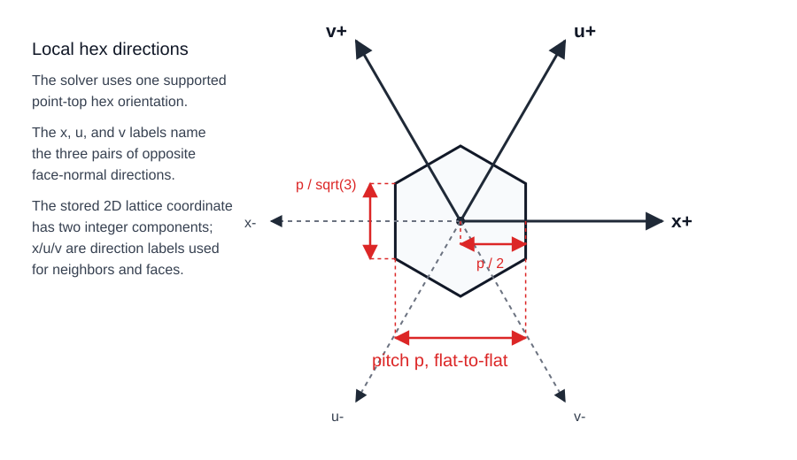
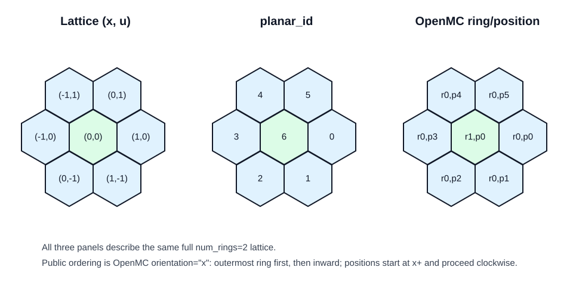
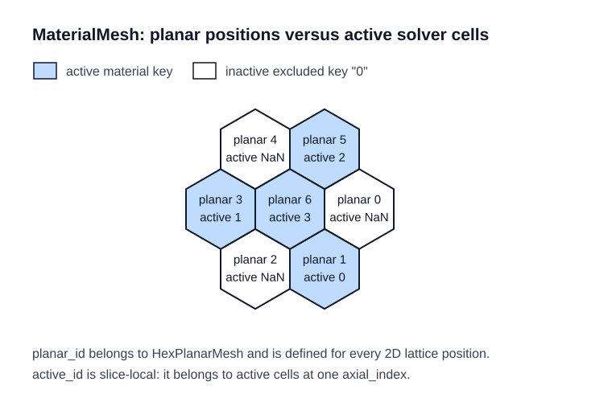
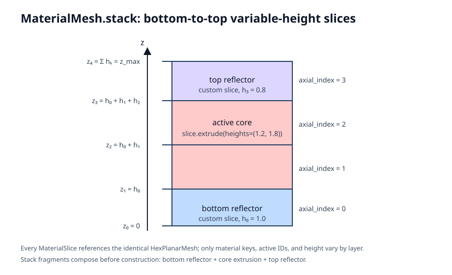

# Geometry and indexing

Morana represents a problem in three layers of description:

1. [`HexPlanarMesh`](reference/core.md#morana.HexPlanarMesh) defines the
   complete regular two-dimensional hexagonal lattice.
2. [`MaterialSlice`](reference/core.md#morana.MaterialSlice) assigns material
   or excluded-region keys to positions in that lattice. Positions without an
   assignment are excluded.
3. [`MaterialMesh.stack(...)`](reference/core.md#morana.MaterialMesh.stack)
   arranges one or more slices from bottom to top to form the finite hex-z
   solution domain.

This page defines the geometry, ordering, and face conventions shared by
those objects. The [modeling and solver workflow](modeling_workflow.md)
describes construction and solve behavior; [inspection and output](outputs.md)
describes how these conventions appear in plots and exported files.

Morana adopts OpenMC's ring-position convention as an indexing reference. Its
geometry is defined entirely by the regular lattice and `(x, u)` coordinates,
without an OpenMC runtime dependency. The separate
[OpenMC MGXS importer](openmc_mgxs.md) supplies selected material data within
this Morana-owned geometry.

## One regular hexagonal cell {#single-cell-geometry}



`pitch` is the finite positive flat-to-flat distance of a regular hexagonal
cell, in cm. `num_rings` is a positive integer. A mesh with `n = num_rings`
has `1 + 3 * n * (n - 1)` full-lattice positions. For every cell in a regular
planar mesh:

- the center-to-center distance across a shared face is `pitch`;
- the center-to-face distance is `mesh.center_to_face == pitch / 2`;
- the face length is `pitch / sqrt(3)`;
- the cell area is `sqrt(3) / 2 * pitch**2`.

Morana labels the three pairs of opposite radial faces `x`, `u`, and `v`.
The labels determine neighbor order and domain-face queries; they do not
represent three stored coordinates. A lattice position has the two integer
coordinates `(x, u)`, and the third hexagonal direction is redundant.

`HexPlanarMesh` is immutable full-lattice geometry only: it has no material
keys, active-cell IDs, or axial layers. A mesh can therefore be inspected or
exported before it is overlaid by `MaterialSlice` and `MaterialMesh`. Its
`coords`, `openmc_indices`, the coordinate-to-`planar_id` lookup, and the
full-lattice neighbor table are constructed once when the mesh is created.
`index_of` exposes that canonical coordinate lookup as an immutable mapping.

The direction names follow the established hexagonal-nodal convention shown in
Figure 1 of [Ferrer, Ougouag, and Bingham (2009)](#ferrer-ougouag-bingham-2009)
and [Lu and Guo (2016)](#lu-guo-2016):
`u` and `v` are counterclockwise rotations of `x` by $60^\circ$ and
$120^\circ$, respectively. Morana's radial face order below remains its own
API convention.

The radial face direction order is:

```python
("x+", "x-", "u+", "u-", "v+", "v-")
```

## Locate a planar lattice position {#2d-lattice-coordinates}



`HexPlanarMesh` provides three complementary identifiers for a position in its
full lattice:

| Identifier | Purpose |
| --- | --- |
| `planar_id` | Flattened full-lattice position used by planar-mesh inspection and geometry export. |
| Lattice coordinate `(x, u)` | Integer geometric coordinate used for topology and Cartesian cell centers. |
| [`OpenMCIndex(ring, position)`](reference/core.md#morana.OpenMCIndex) | Serialized ring-position identity used for OpenMC-style input and output. |

The following convention matters when reading or writing OpenMC-style ring
data. Morana uses the OpenMC `orientation="x"` convention only. In the flattened
full-lattice order, rings run from outermost to innermost. Positions within a
ring start in the positive x direction and proceed clockwise. Thus a full
`num_rings=2` mesh has its center at `planar_id = 6`; a full `num_rings=3`
mesh has its center at `planar_id = 18`. Convert an OpenMC
`orientation="y"` layout before constructing a Morana mesh.

`OpenMCIndex` is an immutable, hashable `(ring, position)` value object used
as the key for sparse `MaterialSlice` input. Its natural ordering is
lexicographic `(ring, position)`: this follows the outer-to-inner serialized
ring sequence, not a spatial walk around the entire lattice. It is a
mesh-relative identifier. Construction requires non-Boolean, nonnegative
integer fields, but only a `HexPlanarMesh` can determine whether the resulting
ring-position pair belongs to that mesh. For a mesh with `n` rings, membership
requires:

```python
0 <= ring < n
0 <= position < max(6 * (n - 1 - ring), 1)
```

`mesh.openmc_indices` supplies the complete valid sequence. Use
`mesh.planar_id_at(index)` for a safe reverse lookup—returning `None` for an
out-of-mesh index—while sparse `MaterialSlice` construction rejects an
out-of-mesh key. `OpenMCIndex` identifies a full planar position only; it is
not the layer-dependent solver `active_id`.

OpenMC defines `orientation` in its
[`HexLattice` API](https://docs.openmc.org/en/stable/pythonapi/generated/openmc.HexLattice.html)
and documents the associated skewed bases in its
[hexagonal-lattice indexing method](https://docs.openmc.org/en/stable/methods/geometry.html#hexagonal-lattice-indexing).

Cartesian cell centers follow directly from `(x, u)` and the flat-to-flat
pitch:

```python
x_cart = pitch * (x + 0.5 * u)
y_cart = sqrt(3) / 2 * pitch * u
```

The lookup methods preserve the same full-lattice convention:

- `lattice_coord(planar_id)` and `openmc_index(planar_id)` return the two
  identities at a known planar position;
- `planar_id_at(OpenMCIndex(ring, position))` performs the reverse lookup and
  returns `None` when that ring-position does not belong to the mesh; and
- `neighbors(planar_id)` returns six entries in radial direction order. An
  entry is another full-lattice `planar_id` or `None` at the physical planar
  perimeter. It does not classify material or excluded-domain interfaces.

All forward planar-ID lookups (`lattice_coord`, `openmc_index`, `neighbors`,
`cartesian_center`, and `cell_vertices`) require a non-Boolean integer in
`0 <= planar_id < n_cells`. They raise `TypeError` for another input type and
`IndexError` when the ID is outside the complete lattice; in particular,
negative IDs never use Python's sequence-indexing convention.

See [inspection and output](outputs.md#planar-mesh) for full-lattice plotting
and VTU export artifacts.

## Select the active planar domain



`HexPlanarMesh` always describes every position in the regular lattice.
`MaterialSlice` supplies a sparse mapping from `OpenMCIndex` values to material
keys for one layer. When slices are stacked, unassigned positions receive the
built-in excluded key `"0"` and are inactive. A `MaterialMesh` can also define
additional mesh-local excluded-region keys with
[`ExcludedRegion`](reference/core.md#morana.ExcludedRegion). This lets boundary
conditions distinguish holes or omitted regions without treating them as
active materials.

Pass additional excluded regions when stacking. Their keys and region kinds
are human-readable identifiers: each must contain a non-whitespace character
and only printable characters, while preserving its exact spelling. Their
values must be `ExcludedRegion` objects, and the built-in inactive key `"0"`
is reserved:

```python
material_mesh = MaterialMesh.stack(
    (lower_slice, upper_slice),
    excluded_regions={"gap": ExcludedRegion(kind="void", color="#d9d9d9")},
)
```

Here, `"gap"` is the excluded-region identity and `"void"` is its kind. Every
`"gap"` position is excluded from the active solver domain, has no material
cross sections or source, and can be selected with
`on_excluded(key="gap")`. A key can occur at several positions or in disconnected
regions; it does not identify a single connected component. A kind groups keys
with shared semantics: for example, `"beam_port_a"` and
`"beam_port_b"` can both have kind `"source_port"`, allowing one boundary rule
to select both by kind or only one by key. Keys and kinds match by exact
equality. `ExcludedRegion` values are immutable descriptions.

The built-in `"0"` identity is always the reserved `"inactive"` kind and uses
the plotting color `"white"`. A custom region without a `color` uses the
default excluded-region plotting color `#d9d9d9`. Any supplied custom color is
passed through without validation and is used by layout plotting.

The two IDs serve different purposes:

- `planar_id` identifies a location in the complete two-dimensional lattice.
  It is independent of axial layer, so the same planar position has the same
  `planar_id` in every layer.
- `active_id` identifies an active solver cell within one selected axial
  layer. It skips excluded positions and may therefore differ between layers.
  The unique active material-mesh position is `(axial_index, active_id)`.

Flux arrays use this compact, active-domain-only `active_id` order. See
[inspection and output](outputs.md) for how plots and exports present those
values on the complete lattice.

For a selected layer, `active_indices(axial_index)` returns the active positions
as the subset of `mesh.openmc_indices` in its documented flattened order.
Every layer-aware cell query takes `axial_index` first, followed by the local
identifier: `key_at(axial_index, openmc_index)`,
`active_id_at(axial_index, openmc_index)`,
`openmc_index_for_active_id(axial_index, active_id)`, and
`face(axial_index, active_id, direction)`. Thus the layer is selected before
the planar or compact-cell position. `active_id_at()` returns the corresponding
compact ID or `None` when the position is excluded or outside the full mesh;
use `key_at()` when those cases need to be distinguished.
`material_by_active_id()` and `openmc_index_for_active_id()` provide the
inverse material and position views.

## Stack layers in the axial direction



A `MaterialSlice` is immutable reusable planar input: one `HexPlanarMesh`
reference, a sparse OpenMC-index material-key mapping, and one finite positive
height. Direct construction is the sparse form: mapping keys must belong to the
mesh, values must be strings, and the mapping is copied to a
read-only view. Positions omitted from the mapping receive the inactive key
`"0"` when the slice is stacked:

```python
slice_0 = MaterialSlice(
    mesh,
    {OpenMCIndex(1, 0): "fuel"},
    height=2.0,
)
```

`MaterialSlice.from_openmc_rings(mesh, rings, height=...)` is the complete
form. It requires one list for each mesh ring, ordered outermost to innermost,
with `max(6 * radius, 1)` entries for a ring of radius `radius`. Positions in
each list use the documented OpenMC `orientation="x"` order. Use direct
construction when omitted positions should remain inactive; use ring input when
the full layer layout is available.

`slice.extrude(count=N)` returns a bottom-to-top tuple that repeats the same
immutable slice `N` times. `slice.extrude(heights=(h_0, ...))` returns one
otherwise identical slice per specified finite positive height. Provide exactly
one form; both fragments can be concatenated before stacking:

```python
slices = reflector.extrude(count=2) + core.extrude(heights=(1.2, 1.8))
material_mesh = MaterialMesh.stack(slices)
```

Create every material mesh, including a one-layer mesh, with
`MaterialMesh.stack((slice_0, ...))`. Its tuple is ordered bottom to top, and
all slices must reference the identical planar mesh instance.

Stacking resolves the independent layer mappings and derives the immutable
`axial_layer_heights` tuple. Every layer-specific `MaterialMesh` query takes
an explicit, nonnegative in-stack `axial_index`.

Layer numbering is bottom-up:

- `axial_index = 0` is the bottom layer;
- `axial_index = 1` is the layer immediately above it;
- `n_axial_layers` is the number of material layers.

The stack starts at `z_min = 0.0` and ends at `z_max`, the sum of its layer
heights. For `h_k = axial_layer_heights[k]`, layer `k` spans:

```python
z_min = sum(h_l for l in range(k))
z_max = z_min + h_k
```

Each layer repeats the same full planar lattice, but material keys,
active/excluded status, compact `active_id` values, and face classifications
are evaluated per layer. Fixed-source and `k_eff` solves therefore support
different active-cell counts in different layers.

## Faces and geometric measures

Every active hex-z cell has six radial faces and two axial faces, `bottom` and
`top`. A radial neighbor is the adjoining planar lattice position in the same
layer. An axial neighbor occupies the same `OpenMCIndex` in the layer below or
above.

A face is classified as:

- `internal` when its neighboring position is active;
- `to_excluded` when its neighboring in-stack position is excluded;
- `outer` when it lies on the physical perimeter of the complete stack.

[`MaterialMesh.face()`](reference/core.md#morana.MaterialMesh.face) returns
the resulting [`DomainFace`](reference/core.md#morana.DomainFace) topology.
Its directions are `x+`, `x-`, `u+`, `u-`, `v+`, `v-`, `bottom`, and `top`.
An internal face has a complete active-neighbor identity; an excluded interface
has a neighboring axial/OpenMC position and excluded key/kind but no active ID;
an outer face has no neighbor fields. Obtain these values from `face()` rather
than constructing them directly.

For a layer of height `h_k`, a radial face has area `face_length * h_k` and an
axial face has the planar hex-cell area. The cell volume is `area * h_k`.
These measures, including unequal layer heights at axial interfaces, enter the
finite-volume diffusion resistance; see the
[theory and numerical conventions](theory_references.md) for the equations.

## References

<a id="ferrer-ougouag-bingham-2009"></a>
**Ferrer, Ougouag, and Bingham (2009).** R. M. Ferrer, A. M. Ougouag, and
A. A. Bingham, *Nodal Green's Function Method Singular Source Term and
Burnable Poison Treatment in Hexagonal Geometry*, INL/EXT-09-16773, Idaho
National Laboratory, 2009. [OSTI bibliographic record](https://www.osti.gov/biblio/983357)
and [open full text](https://inldigitallibrary.inl.gov/content/uploads/50/2026/04/4536703.pdf).

<a id="lu-guo-2016"></a>
**Lu and Guo (2016).** D. Lu and C. Guo, “Development and Validation of a
Three-Dimensional Diffusion Code Based on a High Order Nodal Expansion Method
for Hexagonal-z Geometry,” *Science and Technology of Nuclear Installations*,
2016, Article ID 6340652, DOI
[10.1155/2016/6340652](https://doi.org/10.1155/2016/6340652).
[Open full text](https://onlinelibrary.wiley.com/doi/10.1155/2016/6340652).
