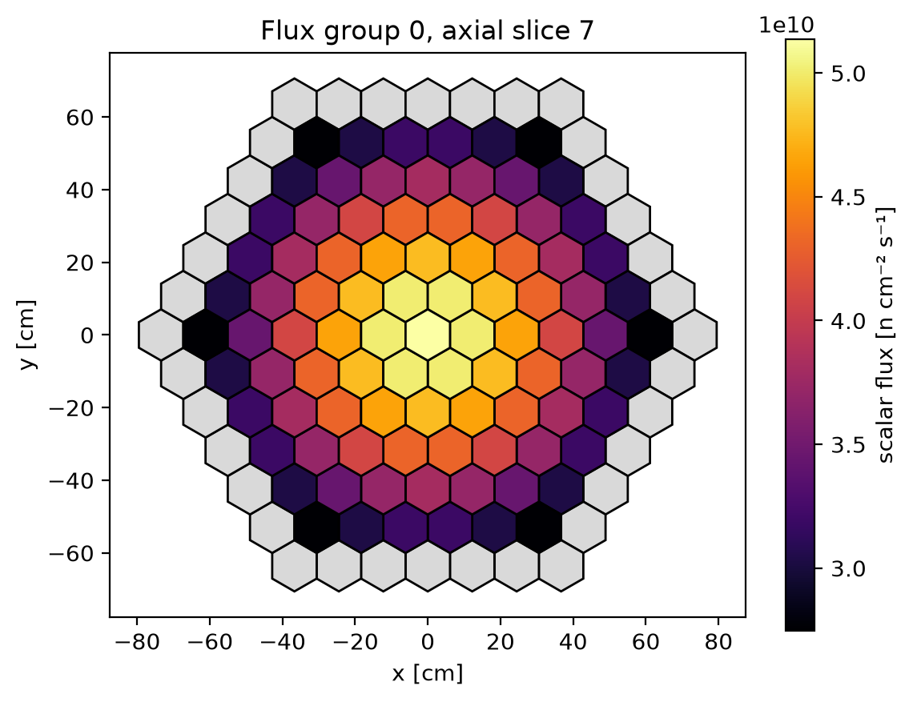
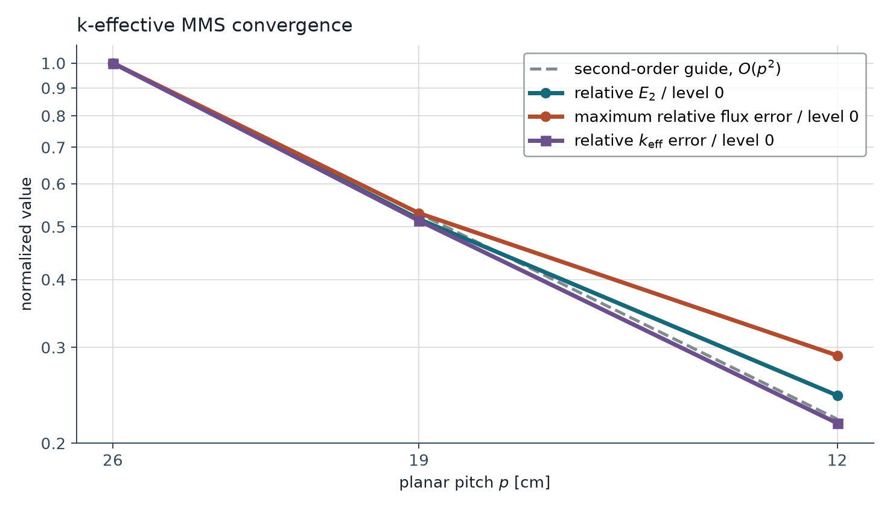

# k-effective manufactured-solution case

This page documents Morana's one-group k-effective method of manufactured
solutions (MMS) case, implemented in
[`examples/keff_mms.py`](https://github.com/tannhorn/morana/blob/main/examples/keff_mms.py).
The case verifies
a manufactured criticality eigenpair.

The companion [fixed-source MMS case](fixed_source_mms.md) introduces MMS and
describes the shared verification construction: target-domain refinement, the
[inactive-shell topology](fixed_source_mms.md#active-core-and-inactive-shell),
and independent [quadrature and boundary-face treatment](fixed_source_mms.md#discrete-mms-data).
This page builds on those common elements and specifies the criticality
eigenpair.

At each refinement level, the case solves a fully three-dimensional
criticality problem with radial and axial diffusion, unequal-height layers,
cell-local fission-production cross sections, and homogeneous Robin boundary
conditions on every exposed face. A positive Gaussian field, its Laplacian,
the fission data, and the boundary response coefficients are evaluated
independently of Morana's assembled operators. The case compares both the
flux shape and multiplication factor with their manufactured references.

The one-group formulation isolates the criticality-specific evidence:
the eigenvalue equation, fission-source normalization, heterogeneous material
extraction, homogeneous boundary handling, and simultaneous radial and axial
refinement. Three-group transfer and independently prescribed volumetric and
Dirichlet sources are covered by the companion fixed-source case.

## Manufactured eigenvalue problem

The one-group continuous equation is

$$
-D\nabla^2\phi+\Sigma_a\phi
=\frac{\nu\Sigma_f}{k_{\mathrm{eff}}}\phi.
$$

Criticality has no independent volumetric forcing or additive boundary source.
The example therefore chooses a positive
flux shape and target eigenvalue, then manufactures the spatially varying
fission-production cross section and homogeneous Robin response needed to
make that eigenpair exact. This preserves the canonical homogeneous
eigenproblem solved by Morana.

## Shared target geometry and refinements

This case uses the fixed-source case's
[regular-hexagonal target prism and pitch construction](fixed_source_mms.md#target-geometry-and-refinements)
without modification: $a=60\ \mathrm{cm}$ is the planar apothem,
$R=2a/\sqrt{3}$ the circumradius, and $H=108\ \mathrm{cm}$ the height. The
active core is an inscribed, non-nested regular cluster, surrounded by one
inactive shell ring; its top and bottom remain fixed at $z=0$ and $z=H$.
The shared refinement schedule is repeated here for reference.

| Level | Active rings | Complete mesh rings | Pitch [cm] | Axial layers | Maximum layer height [cm] | Unknowns |
| ---: | ---: | ---: | ---: | ---: | ---: | ---: |
| 0 | 3 | 4 | 25.981 | 6 | 24 | 114 |
| 1 | 4 | 5 | 18.895 | 9 | 16 | 333 |
| 2 | 6 | 7 | 12.226 | 12 | 12 | 1,092 |

Each base band, with height $2H/9$, $3H/9$, or $4H/9$, is split into
two equal sublayers at level 0, three at level 1, and four at level 2.
Both the planar pitch and maximum axial height therefore decrease through the
study. With one energy group, the unknown count equals the number of active
hex-z control volumes.

## Positive exact eigenfunction

Let $\zeta=z-H/2$. The unnormalized manufactured shape is

$$
\psi(x,y,z)=
\exp\!\left[
-c_r\frac{x^2+y^2}{a^2}
-c_z\frac{\zeta^2}{H^2}
\right],
\qquad c_r=0.60,\quad c_z=1.00.
$$

It is smooth and strictly positive over every refinement domain. Positivity
is important because it avoids singular coefficient ratios and identifies the
manufactured field with the fundamental positive eigenmode rather than a
sign-changing higher mode.

The analytic Laplacian is evaluated from

$$
\frac{\nabla^2\psi}{\psi}
=
4c_r^2\frac{x^2+y^2}{a^4}-\frac{4c_r}{a^2}
+4c_z^2\frac{\zeta^2}{H^4}-\frac{2c_z}{H^2}.
$$

The selected constant loss data are

$$
D=1.20\ \mathrm{cm},
\qquad
\Sigma_a=0.020\ \mathrm{cm}^{-1},
$$

and the target multiplication factor is

$$
k^\star=1.075.
$$

## Manufactured fission production

Pointwise substitution gives the continuous manufactured coefficient

$$
\nu\Sigma_f(x,y,z)
=k^\star\left[
\Sigma_a-D\frac{\nabla^2\psi}{\psi}
\right].
$$

The chosen constants keep this value finite and positive throughout the
target prism. Across the three discrete levels, the cell values range from
approximately $0.02195$ to $0.02258\ \mathrm{cm}^{-1}$. This manufactured
case sets $\Sigma_s=0$ and uses the only possible normalized one-group fission
spectrum, $\chi=1$.

Morana represents cross sections as constants within each active material.
The example therefore assigns one uniquely named active material to every
hex-z cell $c$, with constant $D$ and $\Sigma_a$ but the independently
integrated reaction-rate-preserving value

$$
(\nu\Sigma_f)_c
=
\frac{\displaystyle\int_c\nu\Sigma_f\,\psi\,dV}
{\displaystyle\int_c\psi\,dV}
=
k^\star
\frac{\displaystyle\int_c
\left(-D\nabla^2\psi+\Sigma_a\psi\right)dV}
{\displaystyle\int_c\psi\,dV}.
$$

If the finite-volume unknown equals the exact cell average,

$$
\bar\psi_c=\frac1{V_c}\int_c\psi\,dV,
$$

then Morana's cell-integrated fission term satisfies

$$
\frac{(\nu\Sigma_f)_cV_c\bar\psi_c}{k^\star}
=\int_c\left(-D\nabla^2\psi+\Sigma_a\psi\right)dV.
$$

This reduction preserves the continuous manufactured reaction rate without
using a Morana matrix, finite-volume conductance, or computed flux. Refinement
error includes the numerical leakage and boundary closures and the finite
quadrature used for these integrals. The construction avoids an additional
product-of-cell-averages error in the manufactured fission term.

## Homogeneous Robin boundaries

The fixed-source case introduces the shared `to_excluded` radial and physical
axial boundary topology, independently evaluated face data, and one-sided
finite-volume elimination. This section derives only the source-free Robin
coefficients used by the criticality case. The general
[Robin boundary form and elimination](theory_references.md#robin-current-and-partial-current-return)
are defined in the theory page.

Morana writes every source-free Robin boundary as

$$
J_{\mathrm{out}}=\alpha\phi.
$$

For a radial face $f$, let $\boldsymbol n_f$ be its outward unit normal and
$\boldsymbol r=(x,y)$. The Gaussian field gives

$$
J_{\mathrm{out}}
=-D\boldsymbol n_f\cdot\nabla\psi
=\frac{2Dc_r}{a^2}
\left(\boldsymbol n_f\cdot\boldsymbol r\right)\psi.
$$

Every hexagonal face lies on a line of constant
$\boldsymbol n_f\cdot\boldsymbol r$. Its exact response is
therefore represented by the single nonnegative coefficient

$$
\alpha_f=
\frac{2Dc_r}{a^2}
\left(\boldsymbol n_f\cdot\boldsymbol r_f\right),
$$

where $\boldsymbol r_f$ is the face center. No face quadrature is needed for
this ratio.

At the two axial ends, the outward derivative-to-value ratio is also
constant. Both use

$$
\alpha_{\mathrm{bottom}}
=\alpha_{\mathrm{top}}
=\frac{Dc_z}{H}.
$$

All these conditions are homogeneous: their additive source vector is zero,
so they are eligible for
[`solve_keff()`](reference/finite_volume.md#morana.solvers.finite_volume.solve_keff).

### Inactive shell and local selection

The fixed-source case explains the topology-only inactive shell and its
layer- and position-specific keys. This case reuses that topology but assigns
one homogeneous Robin coefficient, rather than a prescribed flux, to each
selected radial face:

```python
BoundaryCondition.robin(alpha).on_excluded(
    key=shell_key,
    direction=face_direction,
)
```

The executable example asserts that every active radial boundary is a
`to_excluded` face and resolves to its intended local Robin coefficient.
The shared schedule has 30, 42, and 66 radial faces per layer at the three
levels, giving whole-geometry totals of 180, 378, and 792 faces.

## Independent cell data and normalization

The cases share a small helper for the refinement schedule and independent
integration rule; it does not call Morana operator assembly. The
[fixed-source discrete-data section](fixed_source_mms.md#discrete-mms-data)
derives its six-triangle, three-point Gauss--Legendre mapping, Jacobian, nodes,
and weights. The same $6\times3^3=162$-point rule independently evaluates
$\bar\psi_c$ and both integrals in $(\nu\Sigma_f)_c$.

An eigenfunction has an arbitrary amplitude. Morana exposes a physical flux
by normalizing its total fission-neutron production to the configured value

$$
P^\star=10^{15}\ \mathrm{n\,s^{-1}}.
$$

At each level the exact cell averages are therefore scaled by

$$
C_i=
\frac{P^\star}
{\displaystyle\sum_c(\nu\Sigma_f)_cV_c\bar\psi_c},
\qquad
\bar\phi^{(i)}_c=C_i\bar\psi_c.
$$

This is the same production normalization requested from the solver, so the
comparison measures flux-shape error without an arbitrary amplitude mismatch.

## Measures and acceptance criteria

At refinement level $i$, the volume-weighted relative flux error is

$$
E_{2,i}=
\left[
\frac{\sum_cV_{c,i}
\left(\phi^{(i)}_c-\bar\phi^{(i)}_c\right)^2}
{\sum_cV_{c,i}\left(\bar\phi^{(i)}_c\right)^2}
\right]^{1/2},
$$

and the maximum relative flux error is

$$
E_{\infty,i}=
\max_c
\frac{\left|\phi^{(i)}_c-\bar\phi^{(i)}_c\right|}
{\bar\phi^{(i)}_c}.
$$

The eigenvalue error is

$$
E_{k,i}=
\frac{|k^{(i)}_{\mathrm{eff}}-k^\star|}{k^\star}.
$$

Successive observed orders use the actual planar-pitch ratio. For each error
measure $\mathcal E\in\{E_2,E_\infty,E_k\}$,

$$
q_{i\to i+1}(\mathcal E)=
\frac{\log(\mathcal E_i/\mathcal E_{i+1})}{\log(p_i/p_{i+1})}.
$$

Orders are diagnostics rather than acceptance thresholds. The fixed-source
case explains why the non-nested domains, simultaneous planar and axial
refinement, and finite quadrature rule preclude inferring an asymptotic order
from these three levels.

The executable case requires:

- relative eigenvalue-equation residual and scalar balance residual at most
  $10^{-10}$;
- strictly decreasing $E_2$, $E_\infty$, and $E_k$ over all three levels.

## Results and reproduction

Run the maintained case from the repository root:

```bash
python examples/keff_mms.py
```

To repeat the full refinement study with the maintained direct/GMRES and
fixed-Wielandt strategy set, add `--compare-strategies`:

```bash
python examples/keff_mms.py --compare-strategies
```

Each policy is checked independently against the manufactured eigenpair and
the same residual, balance, and refinement-error acceptance criteria. The
ordinary run remains direct-power only so its verification figures stay
compact. The option prints per-strategy/per-level eigenvalue-error,
outer-iteration, and residual rows and writes them to
`strategy_comparison.csv`.
The comparison includes a GMRES-ILU/Wielandt combination as well as the
direct-Wielandt reference. For a one-level table that also reports
informational setup/solve timing and outer/inner counts, run
`examples/solver_comparison.py`.

Regenerate the checked-in convergence and flux figures with:

```bash
python examples/keff_mms.py --documentation-assets-dir docs/assets
```

The recorded direct-solve results are:

| Level | Relative $E_2$ | $E_2$ order | Maximum relative flux error | Maximum-error order | Relative $k_\mathrm{eff}$ error | $k_\mathrm{eff}$ order |
| ---: | ---: | ---: | ---: | ---: | ---: | ---: |
| 0 | $7.738\times10^{-3}$ | — | $1.617\times10^{-2}$ | — | $6.274\times10^{-4}$ | — |
| 1 | $3.997\times10^{-3}$ | 2.075 | $8.562\times10^{-3}$ | 1.996 | $3.219\times10^{-4}$ | 2.095 |
| 2 | $1.894\times10^{-3}$ | 1.716 | $4.687\times10^{-3}$ | 1.384 | $1.366\times10^{-4}$ | 1.970 |

The three levels require 306, 283, and 270 power iterations. Their relative
eigenvalue-equation residuals remain below $4.8\times10^{-12}$, and relative
scalar-balance residuals remain below $2.2\times10^{-16}$.

### Representative flux

The finest mesh's axial slice nearest the physical midplane shows the smooth
radial variation of the manufactured fundamental mode. Gray cells are the
inactive shell and do not participate in the solve.

{ .morana-doc-figure }

### Convergence

{ .morana-doc-figure }

The eigenvalue error is close to the plotted quadratic guide at these levels:
its two observed orders are 2.095 and 1.970. This is consistent with the
smooth positive Gaussian mode, reaction-rate-preserving cell fission data,
and homogeneous Robin response used in this one-group eigenproblem. An
eigenvalue can also benefit from cancellation of flux-shape errors, so its
observed order need not equal the flux order.

The flux evidence is less uniform: the relative-$E_2$ orders are 2.075 and
1.716, while the maximum-relative-error orders are 1.996 and 1.384. These
values alone do not separate boundary, quadrature, and other discretization
errors or establish a general convergence order.

### Output artifacts

By default, the run writes `convergence.csv`, `convergence.png`, a finest-level
midplane-flux PNG, and a material-aware VTM file under
`artifacts/examples/keff_mms/`.

The CSV records pitch, maximum axial height, both flux-error measures,
eigenvalue error, residuals, iteration count, whole-geometry radial-face
count, and observed orders. The convergence plot normalizes all three errors
to their level-0 values and includes an $O(p^2)$ visual guide; that guide is not
an acceptance threshold.

Return to the [verification overview](verification.md) for the scope of this
evidence or the [maintained examples](examples.md) for the other runnable
workflows.
