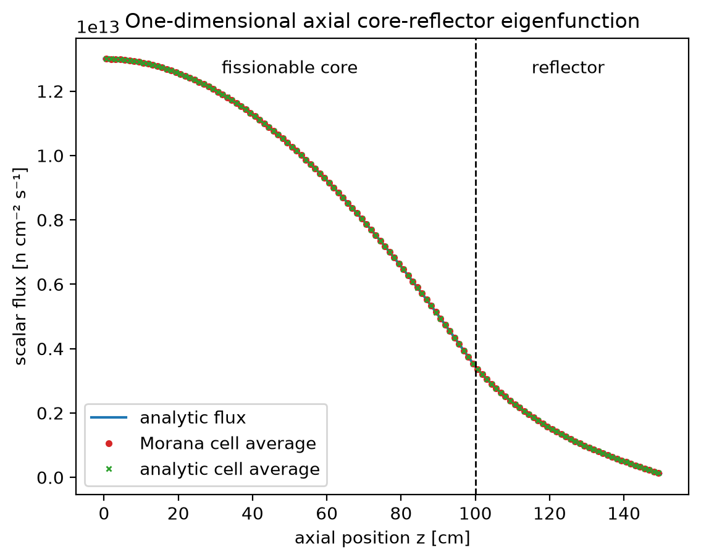

# One-dimensional axial core-reflector case

[`examples/one_group_keff.py`](https://github.com/tannhorn/morana/blob/main/examples/one_group_keff.py)
is a one-group criticality verification case with
an analytic two-region axial diffusion solution. It uses one planar hexagon
and reflective lateral faces, so no radial leakage is present and the hex-z
model reduces exactly to a one-dimensional problem in $z$. The fixed
120-layer discretization is compared with the analytic multiplication factor
and source-normalized cell-average flux.

The lower part of the column is a fissionable core, and the upper part is a
nonfissioning reflector. The bottom is reflective and the reflector top has
Morana's [Marshak-vacuum condition](theory_references.md#marshak-vacuum). The
example writes
`axial_flux_comparison.png` and a material-aware `result.vtm` under
`artifacts/examples/one_group_keff/` by default.

## Model

The core occupies $0\le z\le H_c$ and the reflector occupies
$H_c\le z\le H_c+H_r$, where

$$
H_c=100\ \mathrm{cm},
\qquad
H_r=50\ \mathrm{cm}.
$$

The one-group material data are:

| Region | $D$ [cm] | $\Sigma_a$ [cm$^{-1}$] | $\nu\Sigma_f$ [cm$^{-1}$] |
| --- | ---: | ---: | ---: |
| Core | 1.20 | 0.010 | 0.012 |
| Reflector | 1.50 | 0.002 | 0 |

The example explicitly supplies `sigma_s=[[0.0]]`. A center-only
[`HexPlanarMesh`](reference/core.md#morana.HexPlanarMesh) has one active cell
in every axial layer. The radial faces and physical bottom face are reflective,
while the physical top face is vacuum. The calculation uses 80 equal core
layers and 40 equal reflector layers, each
$1.25\ \mathrm{cm}$ high. The horizontal hex area multiplies every term in the
one-dimensional balance and does not alter the continuous eigenvalue or flux
shape.

## Analytic eigenpair

The one-group criticality equation in the core is

$$
-D_c\frac{d^2\phi_c}{dz^2}+\Sigma_{a,c}\phi_c
=\frac{\nu\Sigma_{f,c}}{k_{\mathrm{eff}}}\phi_c.
$$

Define the positive fundamental-mode buckling and reflector decay constant as

$$
B^2=
\frac{\nu\Sigma_{f,c}/k_{\mathrm{eff}}-\Sigma_{a,c}}{D_c},
\qquad
\kappa^2=\frac{\Sigma_{a,r}}{D_r}.
$$

The reflective bottom condition $d\phi_c/dz=0$ at $z=0$ gives the core shape
with unit amplitude

$$
\phi_c(z)=\cos(Bz).
$$

Let $s=H_c+H_r-z$ be distance downward from the physical top. Morana's vacuum
preset is the homogeneous current condition

$$
J_{\mathrm{out}}=-D_r\frac{d\phi_r}{dz}=\frac12\phi_r
\qquad\text{at }s=0.
$$

Consequently, the reflector shape that already satisfies the top condition is

$$
\phi_r(z)=C\left[
\cosh(\kappa s)+a\sinh(\kappa s)
\right],
\qquad
a=\frac{1}{2D_r\kappa}.
$$

Flux and upward normal current are continuous at the material interface; the
flux derivative changes with the diffusion coefficient. Eliminating $C$ gives
one scalar equation for the
fundamental root $0<B<\pi/(2H_c)$:

$$
D_cB\tan(BH_c)
=D_r\kappa
\frac{\sinh(\kappa H_r)+a\cosh(\kappa H_r)}
     {\cosh(\kappa H_r)+a\sinh(\kappa H_r)}.
$$

An independent bracketed scalar root finder gives

$$
B=0.01303438162\ \mathrm{cm}^{-1},
\qquad
k_{\mathrm{eff}}
=\frac{\nu\Sigma_{f,c}}{\Sigma_{a,c}+D_cB^2}
=1.1760239153,
$$

and flux continuity determines $C$. This reference calculation is independent
of Morana's operators and solver.

## Discrete comparison

An eigenfunction has arbitrary amplitude. Both solutions are normalized to the
configured fission production $P^\star=10^{15}\ \mathrm{n\,s^{-1}}$. For a
single planar-cell area $A_{\mathrm{hex}}$, the analytic scale factor is chosen
so that

$$
P^\star=A_{\mathrm{hex}}\nu\Sigma_{f,c}
\int_0^{H_c}\phi_c(z)\,dz.
$$

Morana stores a cell-average scalar flux, so the reference for each axial
layer $[z_i,z_{i+1}]$ is the exact average

$$
\bar\phi_i=\frac{1}{z_{i+1}-z_i}
\int_{z_i}^{z_{i+1}}\phi(z)\,dz.
$$

The plot below overlays the smooth analytic flux, Morana's cell averages, and
the analytic cell averages. It also marks the core-reflector interface.

{ .morana-doc-figure }

For the discretization of 80 core and 40 reflector layers, the numerical
comparison is:

| Quantity | Analytic reference | Morana result | Relative difference |
| --- | ---: | ---: | ---: |
| $k_{\mathrm{eff}}$ | 1.1760239153 | 1.1760264857 | $2.186\times10^{-6}$ |
| Source-normalized axial cell-average flux | -- | -- | $3.735\times10^{-5}$ relative L2 |

The flux measure is the ordinary L2 norm of the 120 compared cell-average
values. All layers have the same height and planar area, so it is also the
volume-weighted relative L2 norm for this particular mesh. The remaining
difference is the finite-volume discretization error, including the discrete
core-reflector interface and vacuum-face closures.

## Run it

From the repository root with Morana installed in the active environment:

```bash
python -m examples.one_group_keff
```

Pass `--output-dir PATH` to write the PNG and VTM files elsewhere. See the
[maintained examples guide](examples.md) for the complete runnable-example
list, [theory and numerical conventions](theory_references.md) for Morana's
finite-volume and boundary equations, and the
[verification overview](verification.md) for the scope of the comparison.

To regenerate the checked-in figure on this page, run:

```bash
python -m examples.one_group_keff --documentation-assets-dir docs/assets
```
