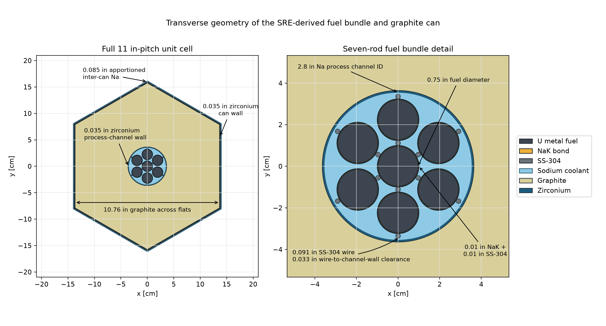
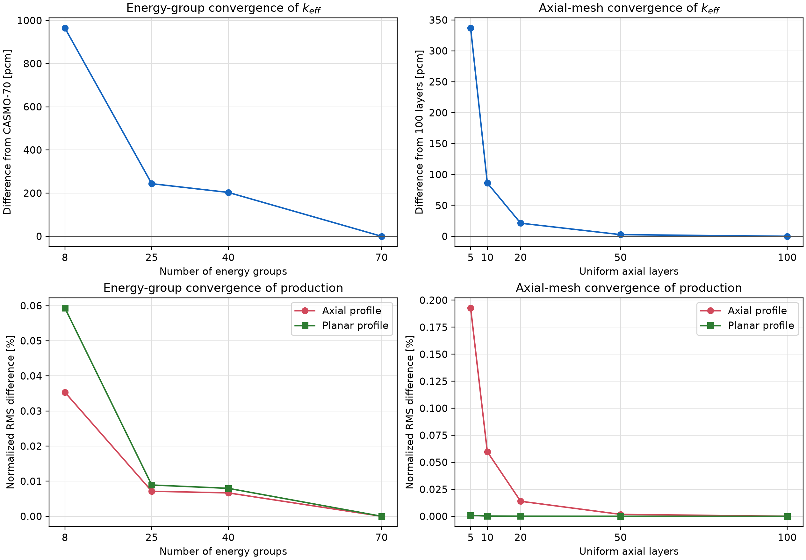
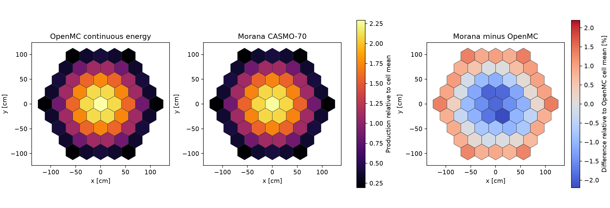
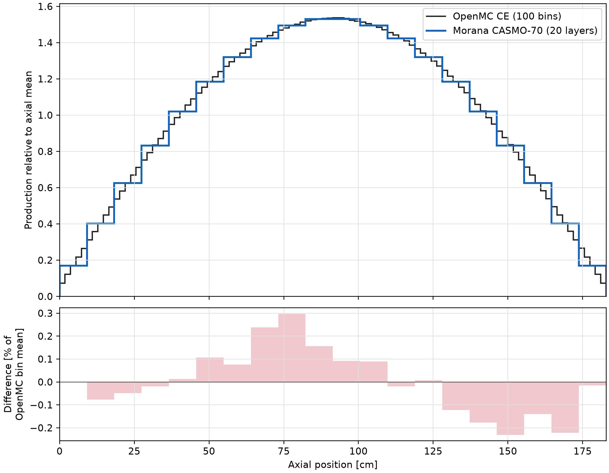

# OpenMC–Morana SRE-derived comparison

This example evaluates Morana against an OpenMC continuous-energy (CE)
reference for a small, bare, sodium-cooled graphite reactor model. Selected
dimensions and material conditions are drawn from the Sodium Reactor
Experiment (SRE), but the model includes only the features needed for this
tutorial. It is not a historical reconstruction, benchmark, or validation
case.

The calculation connects the full workflow: a heterogeneous OpenMC unit
cell supplies homogenized multigroup cross sections (MGXS), Morana solves the
corresponding 61-cell diffusion model, and an independently simulated
heterogeneous OpenMC mini-core supplies the reference multiplication factor
and fission-neutron production profiles.

## Problem definition

### Geometry

The transverse unit cell is an 11-in-pitch, point-up hexagon. It contains a
graphite prism and zirconium can, one central and six peripheral uranium-metal
fuel rods, a NaK bond and stainless-steel tube around each rod, a zirconium
process channel, sodium coolant, and an axially invariant representation of
the documented spiral spacer wire. The outer sodium sliver apportions half of
the 0.170-in gap on each side of the can to the cell.

{ .morana-doc-figure-wide }

The controlling dimensions follow [Starr and Dickinson
(1958)](#starr-dickinson-1958) unless the source column identifies a derived
treatment:

| Feature | Selected value | Source or treatment |
| --- | ---: | --- |
| Fuel-element pitch | 11.000 in | Table 2-1 |
| Zirconium can wall | 0.035 in | §2-2.2 |
| Inter-can sodium gap | 0.170 in | §2-2.2 |
| Graphite prism across flats | 10.760 in | Pitch less two can walls and the sodium gap |
| Fuel diameter | 0.750 in | Table 2-1 |
| NaK bond / steel tube thickness | 0.010 / 0.010 in | Table 2-1 |
| Process-channel ID / wall | 2.800 / 0.035 in | Table 2-1 |
| Spacer-wire diameter | 0.091 in | §5-4.1; transverse surrogate |
| Wire-to-channel-wall clearance | 0.033 in | Derived from tangent outer wires and the selected process-channel ID |
| Active height | 72.0 in | Six-foot principal core height |

The three-dimensional mini-core is a complete five-ring cluster of 61 copies
of this cell. Its 156 shared internal edges are transmissive, and the 54
exposed radial edges are vacuum boundaries. Vacuum conditions also apply at
the top and bottom. There is no enclosing sodium region, reflector, control or
safety element, shim element, or special peripheral cell. This intentionally
simple layout isolates homogenization and diffusion effects.

### Materials and physical state

Every material is at 658.15 K, the arithmetic mean of the documented 500 °F
inlet and 950 °F outlet temperatures in
[Starr and Dickinson (1958), §2-2.1](#starr-dickinson-1958). The tutorial
compositions and solid-material densities use
[Detwiler et al. (2021)](#pnnl-15870-rev2) where identified below.

| Material | Composition | Density [g/cm³] | Source or treatment |
| --- | --- | ---: | --- |
| Fuel | U metal, 2.8 wt% U-235 | 18.944 | Enrichment rounded from SRE Table 2-1; density from PNNL |
| Graphite | Reactor-grade graphite with 1 ppm B | 1.700 | PNNL |
| Zirconium | Natural Zr | 6.52 | PNNL |
| Steel | SS-304 | 8.03 | PNNL entry 331, p. 226 |
| NaK | 78.6 wt% K / 21.4 wt% Na | 0.78143 | Composition and 658.15-K correlation from [Black and Wulff (1972)](#nasa-cr-128595) |
| Sodium | Natural Na | 0.861170 | 658.15-K saturation-curve correlation from [Fink and Leibowitz (1995)](#fink-leibowitz-1995) |

The recorded OpenMC calculations used a locally corrected OpenMC 0.16.0 build
for MGXS continuations (see the
[restart requirements](openmc_comparison_workflow.md#reproduce-the-discretization-studies)) with
[ENDF/B-VIII.1 continuous-energy data](https://openmc.org/data/). OpenMC
applied the `c_Graphite` thermal-scattering treatment and interpolated the
available nuclear data to the common material temperature.

## Simulation approach

The comparison has three calculation stages. The energy-group and axial-mesh
studies choose their resolutions without fitting them to the CE results.

1. **Continuous-energy reference.** OpenMC models every material region in
   the heterogeneous 61-cell mini-core, which is 72.0 in (182.88 cm) high. A
   calculation with 100 million active histories directly tallies
   `nu-fission` in 100 uniform axial bins integrated over the core and in the
   61 root cells integrated over height. It uses 20,000 particles per
   generation, 5,200 batches (200 inactive), and seed 31415. The result
   qualified for final comparison only if the $k_\mathrm{eff}$ standard
   deviation was at most 10 pcm and every direct axial and planar tally had a
   relative standard deviation of at most 1%.
2. **Homogenized MGXS.** A separate two-dimensional unit cell has reflecting
   radial boundaries. OpenMC tallies the CASMO-70 structure and condenses the
   same reaction rates and flux data to CASMO-40, CASMO-25, and CASMO-8. The
   exported record contains `TransportXS`, absorption, consistent ordinary P0
   scattering, scattering multiplicity, and a general incident-to-outgoing
   `nu-fission` transfer matrix. OpenMC's transport correction is stored in
   the runtime `total` field, so Morana imports it with `diffusion="total"`
   and does not apply another P1 correction.
3. **Diffusion calculation.** Morana assigns the one homogenized record to
   every planar cell, uses 20 uniform axial layers for the selected result,
   and applies vacuum conditions on every exterior face.

The selected MGXS statistics use three independent seeds, each with 40
million active histories, 20,000 particles per generation, five generations
per batch, and 100 inactive batches. Each 40-million-active-history MGXS
sample continues its corresponding 20-million-active-history sample.

### Comparison measures

Both codes report fission-neutron production rather than recoverable fission
power. Morana forms the cell production from the volume-integrated action of
the imported fission-transfer matrix on the multigroup flux. OpenMC tallies
the corresponding `nu-fission` response directly. The planar and axial
profiles are each normalized to unit total before comparison.

For a candidate profile $x_i$ and reference profile $r_i$, the reported
normalized RMS difference is

$$
E_{\mathrm{RMS}}=
100\frac{\sqrt{N^{-1}\sum_i(x_i-r_i)^2}}
{N^{-1}\sum_i r_i}.
$$

Multiplication-factor differences are reported in pcm as
$10^5(k_{\mathrm{candidate}}-k_{\mathrm{reference}})$. The CE 100-bin axial
profile is summed exactly into the candidate Morana layers; no interpolation
is used.

## Discretization studies

The convergence studies use the same 20-million-history MGXS sample with seed
31415. Consequently, the observed changes predominantly reflect discretization
rather than differences between independent Monte Carlo samples.

The production RMS values in the plots below use finer Morana calculations as
their references, not the CE reference: CASMO-70 for the energy-group study
and the 100-layer CASMO-25 calculation for the axial-mesh study.

{ .morana-doc-figure-wide }

### Energy groups

At 20 axial layers, the coarser structures are compared with CASMO-70:

| Structure | $\Delta k_\mathrm{eff}$ from CASMO-70 [pcm] | Axial-production RMS [%] | Planar-production RMS [%] |
| --- | ---: | ---: | ---: |
| CASMO-8 | 964.460 | 0.035329 | 0.059310 |
| CASMO-25 | 243.610 | 0.007129 | 0.008907 |
| CASMO-40 | 203.118 | 0.006664 | 0.007964 |
| CASMO-70 | - | - | - |

Even CASMO-40 differs from CASMO-70 by about 203 pcm, so CASMO-70 is retained.
The production shapes are much less sensitive than the eigenvalue: spatially
integrated reaction-rate errors can remain small while group condensation
perturbs the neutron balance that determines $k_\mathrm{eff}$.

The need for a relatively fine energy structure is consistent with the direct
MGXS treatment. The reflected unit cell is strongly multiplying, with
$k_\infty\approx1.295$ in the three selected MGXS
samples, whereas leakage reduces the bare mini-core to
$k_\mathrm{eff}\approx0.98$. Homogenization consists of direct reaction-rate
and flux condensation with the reflected unit-cell spectrum; it includes no
leakage-informed spectral iteration or equivalence correction. A finer energy
mesh limits the amount of spectral information discarded by condensation.
This interpretation is
consistent with the spatial and energy weighting issues discussed by
[Boyd et al. (2019)](#boyd-et-al-2019), but the present study does not isolate
each possible source of bias.

### Axial mesh

The axial study uses CASMO-25 and compares each mesh with 100 uniform layers:

| Uniform layers | $\Delta k_\mathrm{eff}$ from 100 layers [pcm] | Axial-production RMS [%] | Planar-production RMS [%] |
| ---: | ---: | ---: | ---: |
| 5 | 336.870 | 0.192660 | 0.000894 |
| 10 | 86.311 | 0.059705 | 0.000228 |
| 20 | 21.205 | 0.013911 | 0.000058 |
| 50 | 2.659 | 0.001775 | 0.000007 |
| 100 | - | - | - |

Twenty layers leave only a 21-pcm eigenvalue difference and a 0.014% axial
profile RMS relative to 100 layers. Further axial refinement is small beside
the energy-condensation and final CE-to-diffusion differences, so 20 layers
are used for the selected calculation.

## Comparison results

The CE reference achieved
$k_\mathrm{eff}=0.9803155\pm0.0000974$ (9.742 pcm, one standard deviation).
The maximum direct-tally relative standard deviations were 0.4244% in the 100
axial bins and 0.2792% in the 61 planar cells.

The selected CASMO-70, 20-layer results are:

| MGXS seed | Morana $k_\mathrm{eff}$ | Morana minus CE [pcm] | Axial-production RMS [%] | Planar-production RMS [%] |
| ---: | ---: | ---: | ---: | ---: |
| 16180 | 0.9853717 | +505.620 | 0.137999 | 1.013620 |
| 27182 | 0.9855220 | +520.642 | 0.138037 | 1.013543 |
| 31415 | 0.9854358 | +512.029 | 0.137953 | 1.013732 |
| Mean | 0.9854432 | +512.763 | 0.137996 | 1.013632 |

Across the three MGXS samples, Morana $k_\mathrm{eff}$ ranges from 0.9853717
to 0.9855220, and the Morana-minus-CE difference ranges from +505.620 to
+520.642 pcm. This 15.022-pcm span is much smaller than the roughly 513-pcm
CE-to-Morana difference. The residual difference is systematic for this model
and may combine whole-cell homogenization, discretization, spectrum mismatch,
the diffusion approximation, and boundary treatment; this comparison does not
assign it to one mechanism.

### Planar production

The maps below integrate production over the full active height and show the
mean of the three selected Morana samples. The first two panels divide each
61-cell profile by its own cell mean. The error panel shows Morana minus OpenMC
as a percentage of the OpenMC cell mean, matching the normalization used by
the planar RMS measure.

{ .morana-doc-figure-wide }

Both calculations reproduce the strong center-to-edge falloff. Morana is
slightly low in the inner core and high around much of the perimeter. The
signed cell differences range from about -2.20% to +1.38% of the OpenMC cell
mean, producing the 1.014% normalized planar RMS. The predominant smooth
radial trend is consistent with a systematic leakage or homogenization effect;
small symmetry-breaking features are consistent with statistical noise in the
CE reference.

### Axial production

The axial figure compares the direct 100-bin CE profile with the 20-layer
Morana profile. Each is shown relative to its own axial-bin mean. The lower
panel first rebins OpenMC exactly to 20 bins, then reports Morana minus OpenMC
as a percentage of the OpenMC bin mean.

{ .morana-doc-figure }

The broad vacuum-boundary shape agrees closely. Differences remain within
about 0.30% of the OpenMC bin mean, and the normalized axial RMS is 0.138%.
The small antisymmetric component is unphysical for this axially symmetric
model and is consistent with statistical noise in the shared CE direct-tally
reference. Because each comparison uses that same CE record, the component is
present across the three MGXS samples and does not represent seed-to-seed
Morana variation.

## Reproduce the example

The [reproduction workflow](openmc_comparison_workflow.md) covers environment
setup, geometry checks, CE and MGXS execution, restart rules, artifact locations,
Morana execution, comparison commands, and
[documentation-figure regeneration](openmc_comparison_workflow.md#regenerate-the-documentation-figures)
for the repository's
[`examples/openmc_comparison/`](https://github.com/tannhorn/morana/tree/main/examples/openmc_comparison)
directory. Raw statepoints, evaluated nuclear data,
runtime-MGXS libraries, result archives, and NumPy arrays are deliberately not
distributed.

## References

**Black and Wulff (1972).** W. Z. Black and W. Wulff, *Space Radiator
Simulation System Analysis*, NASA Contractor Report NASA-CR-128595, April
1972.
[NASA bibliographic record](https://ntrs.nasa.gov/citations/19730002237).

**Boyd et al. (2019).** W. Boyd, A. Nelson, P. K. Romano, S. Shaner,
B. Forget, and K. Smith, “Multigroup Cross-Section Generation with the OpenMC
Monte Carlo Particle Transport Code,” *Nuclear Technology*, 205(7), 928–944,
2019, DOI
[10.1080/00295450.2019.1571828](https://doi.org/10.1080/00295450.2019.1571828).
[Open full text](https://www.osti.gov/servlets/purl/1559869).

**Detwiler et al. (2021).** R. S. Detwiler, R. J. McConn Jr., T. F. Grimes,
S. A. Upton, and E. J. Engel, *Compendium of Material Composition Data for
Radiation Transport Modeling*, 200-DMAMC-128170, PNNL-15870, Rev. 2, Pacific
Northwest National Laboratory, April 2021.
[Open full text](https://mcnp.lanl.gov/pdf_files/TechReport_2021_PNNL_PNNL-15870Rev.2_DetwilerMcConnEtAl.pdf).

**Fink and Leibowitz (1995).** J. K. Fink and L. Leibowitz, *Thermodynamic and
Transport Properties of Sodium Liquid and Vapor*, ANL/RE-95/2, Argonne
National Laboratory, January 1995.
[Open full text](https://researchdata.brighton.ac.uk/id/eprint/258/3/Thermodynamic%20and%20transport%20porperties%20of%20sodium%20liquid%20and%20vapor.pdf).

**Starr and Dickinson (1958).** Ch. Starr and R. W. Dickinson,
*Sodium Graphite Reactors*. Addison-Wesley Publishing Company, Inc., 1958.
[Open full text](https://www.energy.gov/sites/default/files/2023-08/Doc._No._67_SRE_in_Sodium_Graphite_Reactors_1958.pdf).
