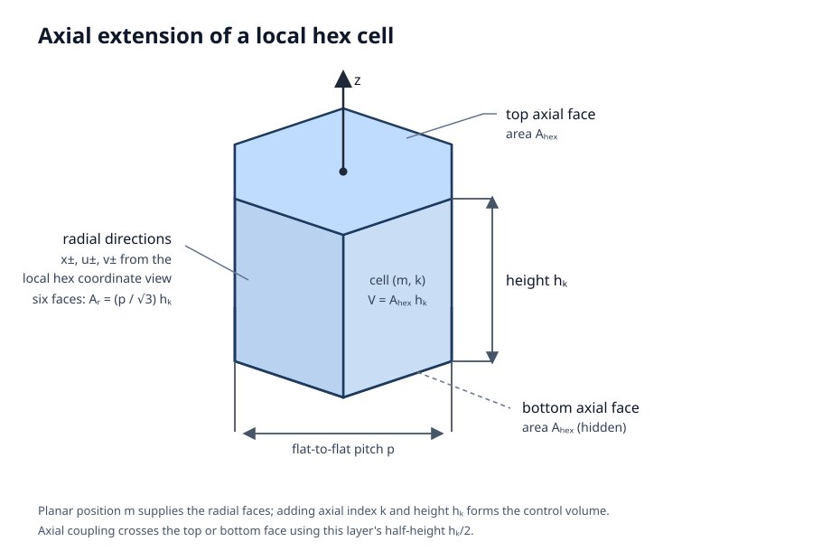
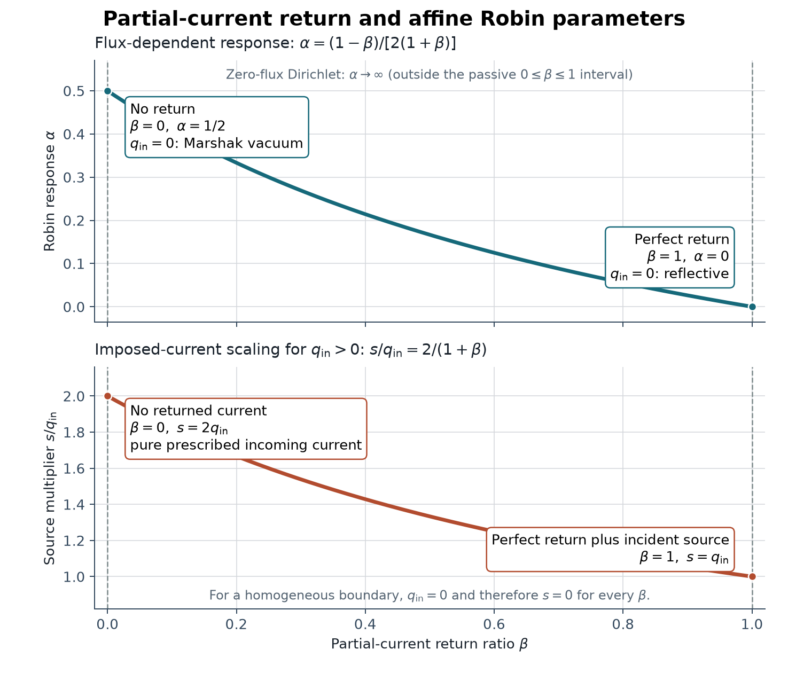

# Theory and numerical conventions

This page is the implementation-level mathematical reference for Morana's
steady-state, multigroup neutron-diffusion solver. It defines the equations,
discretization, boundary reductions, linear and eigenvalue iteration,
normalizations, and residuals used by the finite-volume implementation.
The cited sources provide the broader reactor-diffusion background; the
[modeling and solver workflow](modeling_workflow.md) provides the input and API
context. The
[verification guide](verification.md) records the evidence for these equations
and their implementation.

## Scope and sources

The classical diffusion, multigroup, partial-current, and criticality
background follows [Bell and Glasstone (1970, Chs. 2--4, especially
§§2.5d, 3.1e, and 4.3--4.4)](#bell-and-glasstone-1970).
The control-volume terminology and conservative two-point flux construction
follow [Eymard, Gallouët, and Herbin (2000, §§1, 9.1, and 11.1)](#eymard-gallouet-herbin-2000).
Citations identify the background result being used. Array ordering,
geometric packing, the affine boundary convention, the zero-diffusion limit,
convergence measures, and physical normalization are Morana-specific choices
defined on this page. The [boundary guide](boundary_conditions.md) defines
face selection and supported condition inputs; result layouts and callable
behavior are defined in the
[modeling and solver workflow](modeling_workflow.md).

## Governing equation and units

The implemented finite-volume reference solver uses diffusion on a regular
hex-z mesh. With no fission production and either no scattering or
unit-multiplicity self-scattering, its one-group fixed-source equation reduces
to

$$
-\nabla \cdot (D\nabla\phi) + \Sigma_a\phi = Q.
$$

The finite-volume unknown is a cell-average scalar flux, and the matrix
equation is volume-integrated. Length is expressed in cm and time in seconds:
macroscopic cross sections are in $\mathrm{cm}^{-1}$, diffusion coefficients
in cm, scalar flux in $\mathrm{n\,cm^{-2}\,s^{-1}}$, and volumetric sources in
$\mathrm{n\,cm^{-3}\,s^{-1}}$. When supplied, `kappa_sigma_f` is a
recoverable-energy production cross section in $\mathrm{eV\,cm^{-1}}$.
Morana converts its energy factor using the exact SI relation
$1\ \mathrm{eV}=1.602176634\times10^{-19}\ \mathrm{J}$ before comparing it
with a power-normalization target in W. Energy groups are ordered fast to
thermal but have no stored energy bounds; temperature is not an input to the
solver.

## Imported diffusion coefficients {#imported-diffusion-coefficients}

Morana normally receives each group diffusion coefficient $D_g$ directly.
The [OpenMC MGXS adapter](openmc_mgxs.md) instead requires the caller to select
one of two conversions from a supported runtime-library record. The `"total"`
convention uses the runtime field exactly as stored:

$$
D_g=\frac{1}{3\Sigma_{\mathrm{stored},g}}.
$$

The OpenMC
[`XSdata.set_total_mgxs(...)` API](https://docs.openmc.org/en/stable/pythonapi/generated/openmc.XSdata.html#openmc.XSdata.set_total_mgxs)
accepts either `TotalXS` or `TransportXS` for the same `XSdata` total cross
section, which the runtime format exports as `total` without recording which
one supplied it. Thus this conversion is uncorrected when
$\Sigma_{\mathrm{stored}}$ is a total cross section and already transport
corrected when it is a transport cross section. Morana cannot infer or retain
that provenance.

The `"p1-outscatter"` convention requires
$\Sigma_{\mathrm{stored}}=\Sigma_t$ from an uncorrected `TotalXS`. It uses the
ordinary-event P1 scattering matrix in Morana's incoming-to-outgoing
orientation:

$$
\Sigma_{tr,g}=\Sigma_{t,g}-\sum_h\Sigma_{s1,g\to h},
\qquad
D_g=\frac{1}{3\Sigma_{tr,g}}.
$$

The sum fixes the incident group $g$ and ranges over outgoing groups $h$. This
is the group-discrete form of the outscatter approximation in
[Ványi et al. (2021), §2.1](#vanyi-et-al-2021), not the in-scatter correction
used by OpenMC `TransportXS` and
[Boyd et al. (2019), Eqs. 10–11](#boyd-et-al-2019).
Scattering multiplicity does not enter this correction. Applying it to a
stored `TransportXS` would double-correct the cross section and is invalid;
Morana cannot detect that provenance error from the runtime file. The importer
rejects a nonfinite or nonpositive required stored or derived cross section but
does not substitute another convention. OpenMC's
[`XSdata` reference](https://docs.openmc.org/en/stable/pythonapi/generated/openmc.XSdata.html)
defines the source fields and array shapes.

## Multigroup formulation {#multigroup-formulation}

The implemented solver supports any positive number of energy groups across a
variable-height axial stack.

### Ordering and assembly

Public group-indexed data are ordered fast to thermal. Layered source and result
arrays are group-major with shape `(G, N)`, while material transfer matrices
use `(g_from, g_to)`. Global finite-volume operators use node-major,
group-fastest packing, `I(n, g) = nG + g`, where $n$ is a packed active-node
index.

### Scattering, fission, and operator split

Primitive P0 scattering data use `sigma_s[g_from, g_to]`: the first index is
the group in which an event occurs and the second is its destination group.
The scattering-neutron multiplicity matrix $M$ has the same orientation. When
every event emits one neutron, every entry of $M$ equals one.
Scattering multiplicity represents neutron-producing scattering reactions,
such as $(n,xn)$ reactions. In the multigroup convention used here, each entry
is the scattering-neutron production rate divided by the corresponding
ordinary scattering-event rate ([Boyd et al., 2019, §III.D](#boyd-et-al-2019)).
For one material and cell, let $S$ be the ordinary scattering-event matrix and
$M$ the scattering-neutron multiplicity matrix. Their elementwise product
$T=M\odot S$ is the scattering-neutron transfer matrix. Morana then defines
the signed scattering-coupling matrix $C$ by

$$
C_{g,h}=\begin{cases}
T_{g,h}, & g\ne h,\\
T_{g,g}-S_{g,g}, & g=h.
\end{cases}
$$

Classical multigroup diffusion distinguishes ordinary scattering-event removal
from intergroup scattering source ([Bell and Glasstone, 1970,
§4.3](#bell-and-glasstone-1970)). Morana extends that scattering treatment with
signed scattering-neutron coupling to represent non-unit scattering
multiplicity ([Boyd et al., 2019, §III.D](#boyd-et-al-2019)).

The diagonal correction subtracts the ordinary self-scattering event, so
unit-multiplicity self-scattering has no net effect. Thus $C_{g,h}$ is the
signed scattering-neutron coupling from incident group $g$ to outgoing group
$h$: off-diagonal entries are neutron emission, whereas a diagonal entry is
the neutron gain or loss relative to conventional self-scattering.
The $T$ and $C$ construction, its same-group diagonal correction, and the
assembled-loss acceptance condition are Morana-specific conventions.
Conventional removal remains based on ordinary event loss, not neutron emission
multiplicity:

$$
\Sigma_{r,g}=\Sigma_{a,g}+\sum_{h\ne g}\Sigma_{s0,g\to h}.
$$

With this incoming-to-outgoing storage, scattering coupling into group $g$ is
$\sum_h C_{h,g}\phi_h$. Let $H$ be the volume-integrated matrix containing
conventional removal, radial and axial diffusion, and boundary loss. Let
$\mathcal{C}$ be the volume-integrated, cell-local assembly of $C$. The public
loss matrix is

$$
A=H-\mathcal{C}^T.
$$

Thus the event-oriented input entry `sigma_s[g_from, g_to]` contributes to
the assembled operator row for `g_to` and column for `g_from`; equivalently,
the energy-space scattering production operator uses the transpose of the
input indexing.

Its diagonal includes the volume-integrated $-C_{g,g}$ contribution, so
same-group multiplication is explicit. Unit multiplicity gives a zero
coupling diagonal and recovers the ordinary-scattering operator. A steady
solve requires every assembled loss diagonal to remain positive after this
term and all leakage contributions are included. Consequently, nonnegative
scattering multiplicities are valid input data, but loss assembly rejects a
configuration whose same-group scattering multiplication makes an assembled
diagonal nonpositive. Such an operator lies outside Morana's accepted
steady-solve domain.

For a one-group material, there is no *intergroup* scattering, but that does
not make arbitrary self-scattering disappear. The formulas reduce to

$$
\Sigma_r=\Sigma_a,
\qquad
C_{1,1}=(M_{1,1}-1)\Sigma_{s0,1\to1}.
$$

Self-scattering therefore cancels only when its multiplicity is one (or its
cross section is zero). A non-unit same-group multiplicity remains a signed
neutron gain or loss in the assembled equation.

Morana represents local fission neutron production with the nonnegative,
event-oriented fission-transfer matrix $T^{\mathrm{f}}$. Its entry
$T^{\mathrm{f}}_{g_{\mathrm{from}},g_{\mathrm{to}},n}$ is the production
cross section from incident group $g_{\mathrm{from}}$ to emitted group
$g_{\mathrm{to}}$ at node $n$. This is the extracted form of
`fission_transfer[g_from, g_to]`; its first index selects the fissioning
incident group and its second selects the emitted group.

Group-to-group fission-production matrices retain both incident and emitted
energy-group dependence ([Boyd et al., 2019, §III.G](#boyd-et-al-2019)). The
incident-group fission-production cross section is the transfer row sum,

$$
p_{g,n}=\sum_h T^{\mathrm{f}}_{g,h,n}.
$$

The volume-integrated fission-emission matrix is

$$
F_{(n,g_{\mathrm{to}}),(n,g_{\mathrm{from}})}
=T^{\mathrm{f}}_{g_{\mathrm{from}},g_{\mathrm{to}},n}V_n.
$$

Each node contributes one such $G\times G$ block. Its rows select the group
receiving fission emission and its columns select the group producing it. The
separable representation is the special case

$$
T^{\mathrm{f}}_{g_{\mathrm{from}},g_{\mathrm{to}},n}
=\nu\Sigma_{f,g_{\mathrm{from}},n}\chi_{g_{\mathrm{to}},n},
$$

where the normalized outgoing spectrum $\chi$ is independent of the
incident group. It gives an outer-product local block. General transfer data
need not be separable and do not contain an independent $\chi$.

The groupwise fission source functionals used throughout this page are

$$
\begin{aligned}
P_g(\boldsymbol\phi)
  &=\sum_n p_{g,n}V_n\phi_{g,n}
  &&\text{(production by group $g$)}, \\
E_g(\boldsymbol\phi)
  &=\sum_{n,h}T^{\mathrm{f}}_{h,g,n}V_n\phi_{h,n}
  &&\text{(emission into group $g$)}, \\
K_g(\boldsymbol\phi,k_{\mathrm{eff}})
  &=\frac{E_g(\boldsymbol\phi)}{k_{\mathrm{eff}}}
  &&\text{(eigenvalue-scaled source into group $g$)}.
\end{aligned}
$$

Because $p_{g,n}$ is the transfer row sum,

$$
P(\boldsymbol\phi)
\equiv\sum_gP_g(\boldsymbol\phi)
=\sum_gE_g(\boldsymbol\phi),
\qquad
\sum_gK_g(\boldsymbol\phi,k_{\mathrm{eff}})
=\frac{P(\boldsymbol\phi)}{k_{\mathrm{eff}}}.
$$

### Fixed-source and eigenvalue systems

Let $\mathbf b_Q$ denote the volume-integrated independent volumetric source
and let $\mathbf b_\partial$ denote all additive boundary contributions from
prescribed face flux or incident partial current. Define the complete
fixed-source right-hand side once as

$$
\mathbf b \equiv \mathbf b_Q+\mathbf b_\partial.
$$

The canonical fixed-source problem is then

$$
\left(A-F\right)\boldsymbol\phi=\mathbf b.
$$

Criticality uses the same assembled loss matrix but no independent source,
giving the standard multigroup diffusion $k$-eigenvalue problem
([Bell and Glasstone, 1970, §4.4](#bell-and-glasstone-1970)):

$$
A\boldsymbol\phi
=\frac{1}{k_{\mathrm{eff}}}F\boldsymbol\phi.
$$

## Finite-volume discretization

The cell-centered finite-volume scheme assembles every energy group over the
complete axial material stack into one coupled sparse system. The following
sections define the entries of $H$, $\mathbf b_Q$, and $\mathbf b_\partial$
and apply the scattering-coupling and fission-emission operators
$\mathcal{C}$ and $F$ to the cell balances.

A geometric active cell is $c=(m,k)$, where $m$ is its full-lattice
`planar_id` and $k$ is its `axial_index`. The same $m$ denotes the same planar
position in every layer, whereas `active_id` is slice-local and can differ
between layers. The packed-node index $n(c)$ appears only in assembled vectors
and matrices.

Let the cell have volume $V_c$, group-$g$ cell-average flux $\phi_{g,c}$,
diffusion coefficient $D_{g,c}$, derived removal cross section
$\Sigma_{r,g,c}$, and volumetric source $Q_{g,c}$. Integrating the fixed-source
group equation over $c$ gives
the local conservative balance that defines the finite-volume method
([Eymard, Gallouët, and Herbin, 2000, §1, Example 1.2,
Eq. 1.8](#eymard-gallouet-herbin-2000)):

$$
\sum_{f\in\partial c} J_{\mathrm{out},g,c,f} A_f
  + \Sigma_{r,g,c}V_c\phi_{g,c}
  - \sum_h C_{h,g,c}V_c\phi_{h,c}
  - \sum_h T^{\mathrm{f}}_{h,g,c}V_c\phi_{h,c}
  = Q_{g,c}V_c.
$$

$J_{\mathrm{out},g,c,f}$ is positive when group-$g$ neutrons leave cell $c$
through face $f$. The scattering sum is the net scattering contribution into
group $g$: it includes transfers from every other group and any same-group
neutron gain or loss. It uses the local $C_{h,g,c}$ data assembled into
$\mathcal{C}$. With unit multiplicity, $C_{g,g,c}=0$ and
$C_{h,g,c}=\Sigma_{s0,h\to g,c}$ for $h\ne g$, recovering the usual
off-diagonal ordinary-scattering source. The fission sum is the emission into
group $g$ from every incident group; it uses the local
$T^{\mathrm{f}}_{h,g,c}$ data assembled into $F$. For the criticality
equation, $Q_{g,c}=0$ and the fission term is divided by $k_{\mathrm{eff}}$.

For a layer of height $h_k$ and regular flat-to-flat hex pitch $p$, let
$A_{\mathrm{hex}}$ be the planar hex area. The cell and face measures are

$$
\begin{aligned}
 A_{\mathrm{hex}} &= \frac{\sqrt{3}}{2}p^2, \\
 V_c &= A_{\mathrm{hex}}h_k && \text{for $c=(m,k)$}, \\
 A_{r,k} &= \frac{p}{\sqrt{3}}h_k, \\
\ell &= p && \text{(center-to-center distance)}, \\
d &= \frac{p}{2} && \text{(center-to-face distance)}.
\end{aligned}
$$

An internal face joins two active cells and contributes a conservative
two-cell coupling. An exposed face has no active neighbor; it contributes a
one-cell boundary term after its condition has been resolved. The internal
radial and axial couplings are derived first, followed by the common
exposed-face boundary treatment. This is a cell-centered two-point flux
approximation on an orthogonal mesh. The face conductance is obtained by
adding the two center-to-face diffusion resistances
([Eymard, Gallouët, and Herbin, 2000, §9.1, Eq. 9.6, and §11.1,
Eq. 11.4](#eymard-gallouet-herbin-2000)).

### Radial internal faces

For each group, consider a radial internal face $f$ shared by cells
$c=(m,k)$ and $c'=(m',k)$. Its area is $A_f=A_{r,k}$, and the material
interface is halfway between their centers. Assuming a constant current
through the two half-cell segments, their diffusion resistances add:

$$
R_{g,c,f}=\frac{\ell/2}{D_{g,c}A_f},
\qquad
R_{g,c',f}=\frac{\ell/2}{D_{g,c'}A_f}.
$$

The outward current integrated over the face is therefore

$$
\begin{aligned}
J_{g,c\rightarrow c'}A_f
  &= \frac{\phi_{g,c}-\phi_{g,c'}}
  {R_{g,c,f}+R_{g,c',f}} \\
  &= \mathcal{G}^{\mathrm{rad}}_{g,c,c'}(\phi_{g,c}-\phi_{g,c'}), \\
 \mathcal{G}^{\mathrm{rad}}_{g,c,c'} &= \frac{D_{g,f}A_f}{\ell}, \\
 D_{g,f} &= \frac{2D_{g,c}D_{g,c'}}
 {D_{g,c}+D_{g,c'}}.
\end{aligned}
$$

Thus $D_{g,f}$ is the harmonic mean of the two group-specific cell diffusion
coefficients. This choice preserves current continuity at a discontinuous
material interface and gives the same conductance in both directions. If
either cell has $D=0$, Morana defines the harmonic mean and face conductance
as zero.

### Axial internal faces

For an axial internal face $f$, let $c_-=(m,k)$ be the lower cell and
$c_+=(m,k+1)$ the upper cell. The face area is $A_f=A_{\mathrm{hex}}$.
The material interface need not be midway between the centers because the
layer heights can differ. The two half-cell resistances and resulting
conductance are, independently for each group,

$$
\begin{aligned}
R^{\mathrm{ax}}_{g,c_-,f}
  &= \frac{h_k}{2D_{g,c_-}A_{\mathrm{hex}}}, \\
R^{\mathrm{ax}}_{g,c_+,f}
  &= \frac{h_{k+1}}{2D_{g,c_+}A_{\mathrm{hex}}}, \\
J_{g,c_-\rightarrow c_+}A_{\mathrm{hex}}
  &= \frac{\phi_{g,c_-}-\phi_{g,c_+}}
  {R^{\mathrm{ax}}_{g,c_-,f}+R^{\mathrm{ax}}_{g,c_+,f}} \\
  &=\mathcal{G}^{\mathrm{ax}}_{g,c_-,c_+}
  (\phi_{g,c_-}-\phi_{g,c_+}), \\
\mathcal{G}^{\mathrm{ax}}_{g,c_-,c_+}
  &= \frac{A_{\mathrm{hex}}}
  {h_k/(2D_{g,c_-}) + h_{k+1}/(2D_{g,c_+})}.
\end{aligned}
$$

For the two rows associated with any internal face, let $\mathcal{G}$ denote
the applicable radial or axial conductance. Its contribution to $H$ is

$$
H_{\mathrm{face},g}=
\begin{bmatrix}
 \mathcal{G} & -\mathcal{G} \\
-\mathcal{G} &  \mathcal{G}
\end{bmatrix}.
$$

It is symmetric, has zero row sum, and transfers neutrons between cells without
creating or destroying them. As for radial interfaces, either adjacent cell
having $D=0$ makes the axial conductance zero.

### Diffusion/removal matrix and assembled loss matrix

Let $\mathcal{N}(c)$ be the active neighbors of cell $c$, and let
$\mathcal{B}(c)$ be its exposed faces. Let $\mathcal{G}_{g,c,c'}$ denote the
applicable radial or axial internal-face conductance and
$\mathcal{G}_{g,c,f}$ the group-$g$ boundary conductance derived in the next
section. The assembled row of $H$ is

$$
\begin{aligned}
H_{(n(c),g),(n(c),g)}
  &= \Sigma_{r,g,c}V_c
   + \sum_{c'\in\mathcal{N}(c)}\mathcal{G}_{g,c,c'}
   + \sum_{f\in\mathcal{B}(c)}\mathcal{G}_{g,c,f}, \\
H_{(n(c),g),(n(c'),g)}
  &=
  \begin{cases}
  -\mathcal{G}_{g,c,c'}, & c'\in\mathcal{N}(c), \\
  0,       & \text{otherwise}.
  \end{cases}
\end{aligned}
$$

The assembled loss matrix returned by the public assembly helper is
$A=H-\mathcal{C}^T$. The local contribution of $-\mathcal{C}^T$ at every
group pair is $-C_{h,g,c}V_c$ in row $(n(c),g)$ and column $(n(c),h)$,
including $h=g$.
In the canonical right-hand side defined above, the row entries are

$$
\begin{aligned}
(b_Q)_{n(c),g}
  &=Q_{g,c}V_c, \\
(b_\partial)_{n(c),g}
  &=\sum_{f\in\mathcal{B}(c)}b_{\partial,g,c,f},
\end{aligned}
$$

where $b_{\partial,g,c,f}$ is the additive contribution from one exposed
face. It is zero for homogeneous conditions,
$\mathcal{G}_{g,c,f}\phi_{b,g,f}$ for
prescribed Dirichlet flux, and the affine incoming-current term derived in the
next section for a boundary with imposed incidence.

Conventional removal contributes $\Sigma_{r,g,c}V_c$ to each same-group
diagonal before scattering coupling is subtracted; the fission-emission
matrix supplies the remaining within-cell coupling. Each
internal face contributes one symmetric two-cell block for each group, while
each exposed face contributes only to its owning group row. This is a
volume-integrated operator: matrix entries have units $\mathrm{cm}^2$, flux
has units
$\mathrm{n\,cm^{-2}\,s^{-1}}$, and both sides of the equation have units
$\mathrm{n\,s^{-1}}$.

## Exposed boundary conditions

An exposed face has no active neighboring cell. It can be a lateral exterior
face, a physical `bottom` or `top` face, or a face bordering a
`to_excluded` material-mesh region. Let $c=(m,k)$ be the owning geometric
cell and $f$ one of its exposed faces. The group-$g$ physical face flux is
$\phi_{b,g,f}$, and $D_{g,c}$ is the adjacent cell coefficient. A radial
exposed face has $A_f=A_{r,k}$ and $d_{c,f}=p/2$; an axial exposed face has
$A_f=A_{\mathrm{hex}}$ and $d_{c,f}=h_k/2$.
Linear variation between the cell center and face gives

$$
J_{\mathrm{out},g,c,f}
=D_{g,c}\frac{\phi_{g,c}-\phi_{b,g,f}}{d_{c,f}}.
$$

Each remaining boundary derivation applies independently to one fixed group
and one exposed pair $(c,f)$. To keep the scalar formulas readable, the fixed
group index is suppressed below: $\phi_c$ denotes $\phi_{g,c}$ and $D_c$
denotes $D_{g,c}$. The local face subscripts are also suppressed on face
values and distances, so $\phi_b$ denotes $\phi_{b,g,f}$ and $d$ denotes
$d_{c,f}$; a conductance written $\mathcal{G}_{cf}$ denotes
$\mathcal{G}_{g,c,f}$.

Robin and partial-current-return coefficients are scalar and apply
independently to every group; prescribed flux and current spectra are
group-resolved. Group-coupled boundary-response matrices are outside this
model.

[Bell and Glasstone (1970, §§2.5d and 3.1e)](#bell-and-glasstone-1970)
provide the physical diffusion basis for the reflective and Marshak-vacuum
conditions below. Morana adopts the outward-current sign convention used on
this page and derives each condition's one-cell finite-volume contribution.
The Dirichlet, generalized Robin, and partial-current-return forms below are
Morana parameterizations built from standard boundary concepts.

Each exposed face must have a boundary condition. Internal active-to-active
faces instead use the two-cell diffusion coupling derived above. A single
finite-height layer reduces to a two-dimensional diffusion model only when
zero axial current is imposed on its bottom and top faces.

Boundary-region selection is defined in
[boundary conditions and face selection](boundary_conditions.md). This section
concerns the face equations after selection and covers their finite-volume
reduction.

The reductions derived below can be summarized as follows. Each
$\mathcal{G}_{cf}$ contributes to the owning diagonal of $H$, and each
$b_{\partial,cf}$ contributes to the boundary right-hand side.

| Boundary condition | Face relation | $\mathcal{G}_{cf}$ | $b_{\partial,cf}$ |
| --- | --- | --- | --- |
| Reflective | $J_{\mathrm{out}}=0$ | $0$ | $0$ |
| Dirichlet | $\phi_b$ prescribed | $D_cA_f/d$ | $\mathcal{G}_{cf}\phi_b$ |
| Marshak vacuum | $J_{\mathrm{out}}=\phi_b/2$ | $D_cA_f/(d+2D_c)$ | $0$ |
| Affine Robin | $J_{\mathrm{out}}=\alpha\phi_b-s$ | $\alpha D_cA_f/(D_c+\alpha d)$ | $sD_cA_f/(D_c+\alpha d)$ |

### Reflective

A reflective face imposes zero normal current:

$$
J_{\mathrm{out}}=0.
$$

Therefore $\mathcal{G}_{cf}=0$; the face contributes nothing to either the
matrix or right-hand side.

### Dirichlet

A Dirichlet face prescribes the physical face flux $\phi_b$. Substitution into
the one-sided current approximation gives

$$
J_{\mathrm{out}}A_f
  = \frac{D_cA_f}{d}(\phi_c-\phi_b).
$$

Defining

$$
\mathcal{G}_{cf}=\frac{D_cA_f}{d},
$$

the face adds $+\mathcal{G}_{cf}$ to $H_{cc}$ and
$+\mathcal{G}_{cf}\phi_b$ to $(b_\partial)_c$. A
zero-Dirichlet condition therefore has no right-hand-side term and generally
leaks more strongly than the vacuum approximation below. A nonzero value
represents a prescribed physical face-flux field and is primarily useful for
verification, truncated-domain calculations, and potential model coupling.
This is a general prescribed-value boundary condition; its physical face-flux
interpretation and finite-volume reduction are defined here for Morana.

### Marshak vacuum

A transport vacuum means zero incoming angular flux. Diffusion theory cannot
represent the angular condition directly, so it is approximated here by the
Marshak condition described through diffusion-theory partial currents by
[Bell and Glasstone (1970, §§2.5d and 3.1e)](#bell-and-glasstone-1970):

$$
J_{\mathrm{out}}=\frac{\phi_b}{2},
$$

equivalently

$$
\phi_b+2D_c\frac{\partial\phi}{\partial n}=0.
$$

Combining this condition with the center-to-face current approximation gives

$$
\begin{aligned}
D_c\frac{\phi_c-\phi_b}{d}
  &= \frac{\phi_b}{2}, \\
\phi_b
  &= \frac{2D_c}{d+2D_c}\phi_c, \\
J_{\mathrm{out}}
  &= \frac{D_c}{d+2D_c}\phi_c.
\end{aligned}
$$

The resulting face conductance is

$$
\mathcal{G}_{cf}=\frac{D_cA_f}{d+2D_c}.
$$

It adds $+\mathcal{G}_{cf}$ to $H_{cc}$ and no right-hand-side term. The
physical-face flux is nonzero; the diffusion solution extrapolates toward zero
outside the physical domain.

### Robin current and partial-current return

Morana parameterizes homogeneous current-to-flux boundary response with the
Robin family

$$
J_{\mathrm{out}}=\alpha\phi_b,
$$

where the normal points outward from the modeled domain and $\alpha$ is the
dimensionless net-current-over-face-flux coefficient. This family includes
the standard reflective and Marshak-vacuum limits; the allowed range and the
conductance reduction below are Morana conventions. Combining this with the
one-sided finite-volume current approximation gives

$$
\begin{aligned}
D_c\frac{\phi_c-\phi_b}{d} &= \alpha\phi_b, \\
\phi_b &= \frac{D_c}{D_c+\alpha d}\phi_c, \\
J_{\mathrm{out}}
  &= \frac{\alpha D_c}{D_c+\alpha d}\phi_c.
\end{aligned}
$$

The integrated face conductance is therefore

$$
\mathcal{G}_{cf}=\frac{\alpha D_cA_f}{D_c+\alpha d}.
$$

This expression includes reflective boundaries at $\alpha=0$, Marshak vacuum
at $\alpha=1/2$, and approaches zero-flux Dirichlet as
$\alpha\rightarrow\infty$. Values $0\leq\alpha\leq1/2$ describe passive
reflector-to-vacuum behavior. Larger nonnegative values are mathematical sinks
and do not represent physical albedo.

For physical albedo, let $\mu=\boldsymbol\Omega\mathbin{\cdot}\mathbf n$,
where $\mathbf n$ is the outward face normal, and choose the local $x$ axis to
point along $\mathbf n$. The unnumbered P1 truncation of Eq. 2.57 displayed on
p. 99 of [Bell and Glasstone (1970, §2.5d)](#bell-and-glasstone-1970) uses
the scalar flux $\phi_0$ and first angular moment $\phi_1$. At the face, these
are $\phi_0=\phi_b$ and $\phi_1=J_{\mathrm{out}}$, so in Morana's notation it
becomes

$$
\psi_{P1}(\boldsymbol\Omega)
=\frac{1}{4\pi}\left(\phi_b+3\mu J_{\mathrm{out}}\right).
$$

Define the nonnegative outgoing and incoming partial currents by the
half-range angular integrals

$$
j^+=\int_{\mu>0}\mu\psi_{P1}(\boldsymbol\Omega)\,d\boldsymbol\Omega,
\qquad
j^-=-\int_{\mu<0}\mu\psi_{P1}(\boldsymbol\Omega)\,d\boldsymbol\Omega.
$$

Evaluating the azimuthal integral and the remaining integrals over
$0<\mu<1$ gives

$$
j^+=\frac{\phi_b}{4}+\frac{J_{\mathrm{out}}}{2},
\qquad
j^-=\frac{\phi_b}{4}-\frac{J_{\mathrm{out}}}{2}.
$$

Thus

$$
j^+ + j^-=\frac{\phi_b}{2},
\qquad
j^+ - j^-=J_{\mathrm{out}}.
$$

Morana parameterizes scalar return using the ratio

$$
j^-=\beta j^+,
\qquad 0\leq\beta\leq1.
$$

Substituting this relation into the partial-current definitions gives the face
flux and net outward current in terms of the outgoing partial current:

$$
\begin{aligned}
\frac{\phi_b}{2}
  &= j^+ + j^-
   = j^+ + \beta j^+
   = (1+\beta)j^+, \\
J_{\mathrm{out}}
  &= j^+ - j^-
   = j^+ - \beta j^+
   = (1-\beta)j^+.
\end{aligned}
$$

Eliminating $j^+$ yields the homogeneous Robin form

$$
J_{\mathrm{out}}
=\frac{1-\beta}{2(1+\beta)}\phi_b
=\alpha\phi_b.
$$

Consequently,

$$
\alpha=\frac{1-\beta}{2(1+\beta)},
\qquad
\beta=\frac{1-2\alpha}{1+2\alpha}.
$$

Thus $\beta=1$ gives perfect return and $\alpha=0$, while $\beta=0$ gives the
Marshak-vacuum response and $\alpha=1/2$. In Morana's convention, $\beta$ is
the returned-to-outgoing partial-current ratio, whereas $\alpha$ is the
net-outward-current-to-face-flux ratio.

An independent nonnegative incident partial current can be included as

$$
j^-=\beta j^+ + q_{\mathrm{in}},
$$

where $q_{\mathrm{in}}$ is the surface-averaged incident partial current for
the energy group under consideration.

The equivalent affine Robin form is

$$
J_{\mathrm{out}}=\alpha\phi_b-s,
\qquad
\alpha=\frac{1-\beta}{2(1+\beta)},
\qquad
s=\frac{2q_{\mathrm{in}}}{1+\beta}.
$$

The relation between partial-current return and affine Robin parameters is
shown in the figure below.

{ .morana-doc-figure }

The upper panel shows how the passive partial-current return ratio $\beta$
maps to the flux-dependent Robin response $\alpha$. The lower panel shows the
normalized imposed-current term for $q_{\mathrm{in}}>0$; when
$q_{\mathrm{in}}=0$, $s=0$ for every $\beta$. The endpoint labels therefore
distinguish the homogeneous Marshak-vacuum and reflective limits from their
affine counterparts with an independent incident source. Zero-flux Dirichlet
is the separate limit $\alpha\rightarrow\infty$ and does not lie on the
passive $0\leq\beta\leq1$ curve.

Combining the affine Robin condition with the one-sided finite-volume
approximation gives

$$
\begin{aligned}
\phi_b
  &= \frac{D_c\phi_c+sd}{D_c+\alpha d}, \\
J_{\mathrm{out}}
  &= \frac{\alpha D_c}{D_c+\alpha d}\phi_c
   - \frac{sD_c}{D_c+\alpha d}.
\end{aligned}
$$

In the finite-volume operator, the first term contributes the Robin conductance

$$
\mathcal{G}_{cf}=\frac{\alpha D_cA_f}{D_c+\alpha d}
$$

to the matrix diagonal, and the incoming term contributes

$$
b_{\partial,cf}=\frac{sD_cA_f}{D_c+\alpha d}
$$

to the boundary right-hand side. For $\alpha=0$, Morana evaluates this as
$b_{\partial,cf}=sA_f$, including when $D_c=0$: a perfectly returning
boundary with an imposed incident current has a prescribed inward net current
and no flux-dependent loss term.

For $D_c=0$ and $\alpha>0$, both the conductance and additive source are zero.
Dirichlet conductance is also zero when $D_c=0$. These are the implementation's
zero-diffusion conventions; the face-flux formulas that divide by
$D_c+\alpha d$ do not define a face flux when both $D_c$ and $\alpha$ vanish.

Setting $\beta=0$ removes the returned-current component; allowing nonzero
$\beta$ combines returned outgoing current with the independent incident
source through the same affine assembly path. The surface-averaged partial
current $q_{\mathrm{in}}$ has units $\mathrm{n\,cm^{-2}\,s^{-1}}$.

Prescribed nonzero Dirichlet data remain a distinct face-flux condition.

!!! note "Albedo convention"

    Morana's $\beta$ is a scalar P1 partial-current return ratio. It is not
    generally equivalent to a quantity called *albedo* in a transport code.
    For example, OpenMC's
    [`Surface.albedo`](https://docs.openmc.org/en/stable/pythonapi/generated/openmc.Surface.html)
    scales particle weight at reflective, periodic, or white surface
    interactions, and OpenMC distinguishes specular `reflective` behavior from
    diffuse `white` behavior in its
    [boundary-condition guide](https://docs.openmc.org/en/stable/usersguide/geometry.html#boundary-conditions).
    Interpreting that value as Morana's $\beta$ is an explicit diffusion
    approximation and does not preserve the transport model's angular
    distinction. Any comparison or conversion must identify the albedo
    convention being used.

## Solver acceptance and balances

### Norms

Morana uses two discrete $L^2$ norms. For any packed node/group vector
$\mathbf x$,

$$
\lVert\mathbf x\rVert_2^2=\sum_{n,g}x_{n,g}^2,
\qquad
\lVert\mathbf x\rVert_V^2=\sum_{n,g}V_nx_{n,g}^2.
$$

The Euclidean norm $\lVert\cdot\rVert_2$ measures algebraic equation defects
in both solve modes. The volume-weighted norm $\lVert\cdot\rVert_V$ compares
successive physical flux shapes, weighting each cell by its volume.

### Linear algebra execution {#linear-algebra-execution}

The fixed-source system uses $B=A-F$ and right-hand side $\mathbf b$. An
ordinary criticality inner iteration uses $B=A$ and right-hand side
$F\boldsymbol\phi^{(n)}$; a fixed-Wielandt iteration changes $B$ as defined
below. Morana offers either a sparse direct reference solve or restarted GMRES
from the zero initial guess. Both policies solve the same algebraic problem
with the same physical-flux acceptance criteria.

For GMRES with a preconditioner $P$, the iterated system is the
left-preconditioned form

$$
P^{-1}B\mathbf x=P^{-1}\mathbf b.
$$

`NoPreconditioner` sets $P=I$. `JacobiPreconditioner` uses the finite,
nonzero diagonal of $B$ as $P$. `IluPreconditioner` uses a threshold
incomplete-LU factorization of $B$ with the configured drop tolerance and
fill bound as $P$. These choices change GMRES's Krylov iteration, not the
system $B\mathbf x=\mathbf b$ or the accepted physical flux. The GMRES and
preconditioner constructions are described by [Barrett et al.
(1994)](#barrett-et-al-1994).

Morana uses SciPy's left-preconditioned GMRES implementation. It minimizes a
preconditioned residual, whereas SciPy tests its own termination criterion
against the original residual
([SciPy GMRES documentation](https://docs.scipy.org/doc/scipy/reference/generated/scipy.sparse.linalg.gmres.html)).

Morana independently applies its own symmetric true-relative-residual check
to every direct or GMRES candidate,

$$
r_{\mathrm{lin}}(B,\mathbf x,\mathbf b)=
\frac{\lVert\mathbf b-B\mathbf x\rVert_2}
{\lVert\mathbf b\rVert_2+\lVert B\mathbf x\rVert_2}.
$$

When both actions are zero, Morana defines this residual as zero. The check
uses the candidate after admissible negative roundoff has been set to zero.
Thus a backend success status or a small preconditioned residual alone cannot
accept a result. The [modeling and solver workflow](modeling_workflow.md)
defines the per-solve setup and reuse lifetime for those numerical resources.

### Balance terms {#balance-terms}

The reported `net_scattering` term combines signed scattering-neutron coupling
with the ordinary outscatter already included in removal. Its domain-total
value for group $g$ is

$$
\begin{aligned}
\mathrm{net\ scattering}_g
  ={}& \sum_{n,h} C_{h,g,n}V_n\phi_{h,n} \\
     &- \sum_n\bigl(\Sigma_{r,g,n}-\Sigma_{a,g,n}\bigr)
       V_n\phi_{g,n}.
\end{aligned}
$$

The first line is reported separately as `scattering_coupling`; the second is
the ordinary event-loss portion of `removal`. With unit multiplicity,
`net_scattering` cancels after summing over all groups, although its individual
group values need not vanish. With non-unit multiplicity, the domain-wide sum
retains the corresponding neutron gain or loss. The solve-mode sections below
combine this term with fission, source, absorption, and leakage diagnostics.

### Fixed-source residual and balance {#fixed-source-residual-and-balance}

For a solution of the canonical fixed-source system, the symmetrically
normalized Euclidean equation residual is

$$
r_{\mathrm{fixed}}=
\frac{\lVert\mathbf b-(A-F)\boldsymbol{\phi}\rVert_2}
{\lVert\mathbf b\rVert_2+\lVert(A-F)\boldsymbol{\phi}\rVert_2}.
$$

Using the source functionals defined above, a groupwise balance distinguishes
production $P_g(\boldsymbol\phi)$ by incident group from emission
$E_g(\boldsymbol\phi)$ into an outgoing group. Their sums agree, but their
individual group values need not. At convergence, the fixed-source group
balance is

$$
\begin{aligned}
\mathrm{source}_g+\mathrm{boundary\ source}_g
+E_g(\boldsymbol\phi)+\mathrm{net\ scattering}_g
-\mathrm{absorption}_g-\mathrm{radial\ leakage}_g
-\mathrm{axial\ leakage}_g=0.
\end{aligned}
$$

For prescribed nonzero Dirichlet flux or incoming current,
$\mathbf b_\partial$ supplies the explicit `boundary_source` term.
The reported leakage terms contain the flux-dependent conductance losses;
subtract `boundary_source` from their sum to obtain net outward leakage for
inhomogeneous boundaries. Internal-face currents cancel in the domain total.
Axial currents cancel
across active-to-active layer interfaces in that global balance; only exposed
axial-face loss remains. A layer-resolved balance retains the signed axial
contribution before this global contraction.

### k-effective iteration and balance {#k-effective-iteration-and-balance}

The k-effective solve uses the canonical multiplication eigenproblem defined
under
[Multigroup formulation](#multigroup-formulation).
It has no independent volumetric or boundary source and requires a homogeneous
condition on every exposed hex-z face, positive fission production, and a
nonsingular assembled loss matrix $A$. Morana's three-part convergence
criterion, iterate admissibility checks, and final physical normalization are
defined below.

The ordinary iteration is the classical power method applied to the implicit
operator $A^{-1}F$ ([Gu, 2000](#gu-2000)). Starting from an all-positive
node-major shape normalized to $P(\boldsymbol{\phi}^{(0)})=1$, the ordinary
policy is

$$
\begin{aligned}
\mathbf e^{(n)} &= F\boldsymbol{\phi}^{(n)}, \\
A\tilde{\boldsymbol{\phi}}^{(n+1)} &= \mathbf e^{(n)}, \\
k_{\mathrm{eff}}^{(n+1)}
  &= P\left(\tilde{\boldsymbol{\phi}}^{(n+1)}\right), \\
\boldsymbol{\phi}^{(n+1)}
  &= \frac{\tilde{\boldsymbol{\phi}}^{(n+1)}}
  {k_{\mathrm{eff}}^{(n+1)}}.
\end{aligned}
$$

#### Fixed Wielandt shift

The convergence of ordinary power iteration is controlled by its modal
separation: a subdominant mode near the dominant mode makes its source shape
change slowly. A Wielandt shift modifies the inner operator while preserving
the physical eigenproblem. For reactor-physics background, including the
dominance-ratio motivation and the tradeoff between acceleration and the
conditioning of a shifted system, see the open MPACT theory manual
([Larsen et al., 2019](#larsen-et-al-2019)). The equations below define
Morana's parameterization and normalization convention.

Morana uses one fixed, nonnegative inverse-multiplication-factor shift
$\sigma$. With the same production-normalized previous shape, it solves

$$
\left(A-\sigma F\right)\mathbf u^{(n+1)}
=F\boldsymbol\phi^{(n)},
$$

then recovers the physical multiplication factor and normalizes the next
shape as

$$
q^{(n+1)}=P\left(\mathbf u^{(n+1)}\right),
\qquad
k_{\mathrm{eff}}^{(n+1)}=
\left(\sigma+\frac{1}{q^{(n+1)}}\right)^{-1},
\qquad
\boldsymbol\phi^{(n+1)}=
\frac{\mathbf u^{(n+1)}}{q^{(n+1)}}.
$$

To see the useful shift range, write the generalized eigenvalues as
$A\boldsymbol\phi_i=\mu_iF\boldsymbol\phi_i$, where the physical
fundamental mode has the smallest positive inverse multiplication factor
$\mu_1=1/k_{\mathrm{eff}}$. The iteration operator
$(A-\sigma F)^{-1}F$ has eigenvalues $1/(\mu_i-\sigma)$ for these modes.
For a real positive spectrum ordered $\mu_1<\mu_2\leq\cdots$,
$0\leq\sigma<\mu_1$ keeps the fundamental transformed eigenvalue positive
and dominant. Moving $\sigma$ toward $\mu_1$ improves its separation from
the other modes and accelerates the outer iteration. At the limit the shifted
operator is singular. A shift above it can lose inverse positivity and produce
nonphysical negative flux, while a shift too close below it makes the inner
linear system poorly conditioned.

Setting $\sigma=0$ recovers the ordinary iteration above.
`WielandtShiftSettings` holds one constant shift for the entire solve. A usable
value normally comes from a reference calculation and must leave the shifted
operator solvable and the recovered inverse multiplication factor positive;
an unusable value raises an error. The inner linear residual is evaluated for
the selected ordinary or shifted system, while the outer residual always
evaluates the original, unshifted eigenvalue equation. Criticality convergence
therefore depends on the outer criteria as well as the shifted linear solves.

Every inner-solve candidate must be finite and numerically nonnegative.
Negative components within the roundoff tolerance are cleaned to zero; a
significantly negative component, nonpositive production, failed inner solve, or nonfinite
iterate rejects the solve. Zero components are valid, and a reducible system
need not have a unique dominant shape.

Convergence requires all three measures:

$$
\delta_{k_{\mathrm{eff}}}
=\frac{|k_{\mathrm{eff}}^{(n+1)}-k_{\mathrm{eff}}^{(n)}|}
{|k_{\mathrm{eff}}^{(n+1)}|},
\qquad
\delta_\phi=
\frac{\lVert\boldsymbol{\phi}^{(n+1)}-\boldsymbol{\phi}^{(n)}\rVert_V}
{\lVert\boldsymbol{\phi}^{(n+1)}\rVert_V},
$$

where the common volume-weighted norm $\lVert\cdot\rVert_V$ compares flux
shape. The symmetric Euclidean equation residual is

$$
r_{k_{\mathrm{eff}}}=
\frac{\left\lVert F\boldsymbol{\phi}^{(n+1)}
      /k_{\mathrm{eff}}^{(n+1)}
      -A\boldsymbol{\phi}^{(n+1)}\right\rVert_2}
{\left\lVert F\boldsymbol{\phi}^{(n+1)}
      /k_{\mathrm{eff}}^{(n+1)}\right\rVert_2
 +\left\lVert A\boldsymbol{\phi}^{(n+1)}\right\rVert_2}.
$$

Only after convergence is the unit-production shape scaled to the requested
physical normalization. `FissionSourceNormalization` specifies a fission
source rate in $\mathrm{n\,s^{-1}}$, so the scaled flux satisfies
$\sum_g P_g(\boldsymbol\phi)=\mathrm{fission\ source\ rate}$. For
`PowerNormalization`, each fissionable material provides a groupwise
recoverable-energy production cross section
$\kappa\Sigma_{f,g}$ in $\mathrm{eV\,cm^{-1}}$. After conversion to joules,
the final scale satisfies

$$
\sum_n V_n\sum_g \kappa\Sigma_{f,g,n}\phi_{g,n}
= \mathrm{requested\ power}\quad [\mathrm{W}].
$$

Morana verifies this requirement for every active fissionable material before
assembling the finite-volume criticality operators; it never forms a partial
power response from only the materials that supplied energy data.

Power normalization uses this input directly because neutron-production data
alone do not determine the recoverable energy released per fission. The
destination-group eigenvalue source is
$K_g(\boldsymbol\phi,k_{\mathrm{eff}})$ as defined above.

The groupwise criticality balance distinguishes incident-group fission
production $P_g(\boldsymbol\phi)$ from outgoing-group eigenvalue source
$K_g(\boldsymbol\phi,k_{\mathrm{eff}})$. With absorption, radial and axial
leakage, and signed scattering-neutron coupling, the group equation closes as

$$
K_g(\boldsymbol\phi,k_{\mathrm{eff}})
-\mathrm{absorption}_g-\mathrm{radial\ leakage}_g
 -\mathrm{axial\ leakage}_g+\mathrm{net\ scattering}_g=0.
$$

With unit scattering multiplicity, summing this equation over groups cancels
`net_scattering`. With non-unit multiplicity, that term instead retains the
associated neutron gain or loss. The remaining source and loss terms have
units $\mathrm{n\,s^{-1}}$.

## References

**Barrett et al. (1994).** R. Barrett, M. Berry, T. F. Chan, J. Demmel,
J. Donato, J. Dongarra, V. Eijkhout, R. Pozo, C. Romine, and H. van der Vorst,
*Templates for the Solution of Linear Systems: Building Blocks for Iterative
Methods*, 2nd edition, SIAM, 1994. Open online sections:
[2.3.4, “Generalized Minimal Residual (GMRES)”](https://www.netlib.org/linalg/old_html_templates/subsection2.6.3.4.html);
[3.1.2, “Left and right preconditioning”](https://www.netlib.org/linalg/html_templates/node54.html);
[3.2, “Jacobi Preconditioning”](https://www.netlib.org/linalg/html_templates/node55.html);
and [3.4, “Incomplete Factorization Preconditioners”](https://www.netlib.org/linalg/html_templates/node59.html).

**Bell and Glasstone (1970).** G. I. Bell and S. Glasstone, *Nuclear Reactor
Theory*, TID-25606, U.S. Atomic Energy Commission, 1970.
[OSTI bibliographic record](https://www.osti.gov/biblio/4074688) and
[open full text](https://www.osti.gov/servlets/purl/4074688).

**Boyd et al. (2019).** W. Boyd, A. Nelson, P. K. Romano, S. Shaner,
B. Forget, and K. Smith, “Multigroup Cross-Section Generation with the OpenMC
Monte Carlo Particle Transport Code,” *Nuclear Technology*, 205(7), 928–944,
2019, DOI
[10.1080/00295450.2019.1571828](https://doi.org/10.1080/00295450.2019.1571828).
[Open full text](https://www.osti.gov/servlets/purl/1559869).

**Eymard, Gallouët, and Herbin (2000).** R. Eymard, T. Gallouët, and
R. Herbin, “Finite Volume Methods,” in *Handbook of Numerical Analysis*,
volume 7, pp. 713–1020, 2000, DOI
[10.1016/S1570-8659(00)07005-8](https://doi.org/10.1016/S1570-8659(00)07005-8).
[Open author manuscript](https://raphaeleh.github.io/PUBLI/bookevol.pdf) and
[HAL record](https://hal.science/hal-02100732v2).

**Gu (2000).** M. Gu, “Power Method” (Section 4.3.1), in Z. Bai, J. Demmel,
J. Dongarra, A. Ruhe, and H. van der Vorst, editors, *Templates for the
Solution of Algebraic Eigenvalue Problems: A Practical Guide*, SIAM,
Philadelphia, 2000. [Open online section](https://netlib.org/utk/people/JackDongarra/etemplates/node95.html).

**Larsen et al. (2019).** E. W. Larsen, B. S. Collins, B. A. Kochunas, and
S. R. Stimpson, editors, *MPACT Theory Manual*, version 4.1,
CASL-U-2019-1874-001, Consortium for Advanced Simulation of LWRs, 2019.
[Open full text, Section 7.7 “CMFD Eigenvalue Solvers”](https://vera.ornl.gov/wp-content/uploads/2020/07/CASL-U-2019-1874-001_MPACT-Theory-Manual.pdf).

**Ványi et al. (2021).** A. S. Ványi, M. Hursin, and S. Czifrus,
“Investigation of Recently Introduced Diffusion Coefficient Generation
Methods,” in *Proceedings of the 30th International Conference Nuclear Energy
for New Europe*, Bled, Slovenia, September 6–9, 2021, paper 311.
[Open full text](https://www.djs.si/nene2021/proceedings/pdf/NENE2021_311.pdf).
